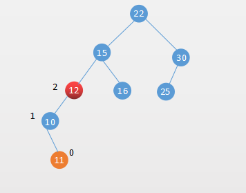

# 平衡二叉树的概念


通过前面的 [《8. 二分搜索树BST》](mks/collections/BST.md)和[《9. Set集合的BST实现和链表实现》](mks/collections/Set.md)的介绍我们知道，二分搜索树的性能跟树的高度(`h`)有关系。`h` 为二分搜索树的高度，那么高度 `h` 和二分搜索树节点数 `n` 的关系是什么呢？

分析下满二叉树的情况就知道了节点数量和二叉树高度的的关系了:


层数 | 该层的节点数
-----|-------
0层  |   1
1层  |   2
2层  |   4
3层  |   8
4层  |   16
h-1层|   2^(h-1)

那么一个h层的满二叉树总共有多少节点呢？就是每层的元素个数相加即可：

`n = 2^0+2^1+2^3+2^4+...+2^(h-1) = 2^h - 1`

用对数表示就是：`h = log(n+1)`

用大O表示法就是： `O(h) = O(log n)`

上面是基于 `满二叉树` 的情况，所以二分搜索树最好情况的时间复杂度为 `O(log n)`

但是根据二分搜索树的性质知道，在最坏的情况二分搜索树会退化成链表，那么二分搜索树的在最坏的情况的时间复杂度为 `O(n)`.

二分搜索树的最好情况的 `O(log n)` 和 最坏情况的 `O(n)` 是个什么概念呢？下面用一个表格对比下：

对比下  `n` 和 `log(n)` 之间的差距

 n      |  log(n)   |  差距
--------|------     |-------
16      |   4       |  4 倍
1024    |   10      |  100倍
100w    |   20      |  5万倍

随着数量不断的加大，它们之间性能的差距不断的两极分化。

这个时候就需要一个能够平衡的二分搜索树，就算在最坏的情况也能保证二分搜索树的性能保持在 `O(log n)`

那么什么是平衡二叉树，`平衡二叉树` 也称 `平衡二分搜索树`（Balanced Binary Tree）是一种结构平衡的`二分搜索树`。

平衡二叉树由二分搜索树发展而来，在二分搜索树的基础上平衡二叉树需要满足两个条件：

1. 它的左右两个子树的高度差的绝对值不超过1
2. 左右两个子树都是一棵平衡二叉树

常见的平衡二叉搜索树有：
1. AVL树
2. 红黑树
3. Treap

下面我们介绍下出现最早的平衡二叉树 `AVL树`。

# AVL树

`AVL树` 是由 G. M. Adelson- V elsky 和 E. M. Landis于1962年提出。AVL树是最早的平衡二叉树。

AVL树维护自身的平衡涉及到两个概念：

1. 节点的高度
2. 节点的平衡因子

节点的高度就是从根节点到该节点的边的总和

节点的 `平衡因子` 是左子树的高度减去它的右子树的高度

带有平衡因子`1、0或 -1`的节点被认为是平衡的，因为它的左右子树高度差不超过 `1`

如下面一颗 AVL树：


上图的AVL树中，节点最大的平衡因子是1，所以它是一颗平衡二叉树。

一颗平衡二叉树的平衡性被打破肯定是在插入或者删除的时候，下面就来看如何在插入和删除的时候保持AVL树的平衡性。

# 插入操作保持AVL树的平衡

## 插入的元素在不平衡节点左侧的左侧，简称 LL

如下面一颗AVL树，在插入节点 `5` 后 节点 `15` 的平衡因子变成了 2，树的平衡性被打破：


这种情况我们称之为 `插入的元素在不平衡节点左侧的左侧` 简称 `LL`

遇到该情况需要对不平衡的节点进行右旋转：


通用情况如下：


右旋转代码：

```java
private Node<K, V> rotateRight(Node<K, V> node) {
    Node<K, V> nodeLeft = node.left;
    Node<K, V> lRight = nodeLeft.right;
    //右旋转
    nodeLeft.right = node;
    node.left = lRight;

    //维护节点高度
    node.height = 1 + Math.max(getHeight(node.left), getHeight(node.right));
    nodeLeft.height = 1 + Math.max(getHeight(nodeLeft.left), getHeight(nodeLeft.right));

    return nodeLeft;
}

```

## 插入的元素在不平衡节点右侧的右侧，简称 RR

这种情况也就是上一个情况的镜像。它需要对不平衡的节点向左旋转：


左旋转代码：

```java
private Node<K, V> rotateLeft(Node<K, V> node) {
    Node<K, V> nodeRight = node.right;
    Node<K, V> rLeft = nodeRight.left;
    //左旋转
    nodeRight.left = node;
    node.right = rLeft;

    //维护节点高度
    node.height = 1 + Math.max(getHeight(node.left), getHeight(node.right));
    nodeRight.height = 1 + Math.max(getHeight(nodeRight.left), getHeight(nodeRight.right));

    return nodeRight;
}

```

## 插入的元素在不平衡节点的左侧的右侧，简称 LR

插入的元素在不平衡节点的左侧的右侧，如下图所示：



这个时候就不能单纯的对节点 `12` 右旋转，11和12都比10要大。这种情况需要两次旋转：


## 插入的元素在不平衡节点的右侧的左侧，简称 RL

插入的元素在不平衡节点的右侧的左侧，如下图所示：


插入操作维护AVL平衡性的相关代码：

```java
public void add(K key, V value) {
    root = _add(root, key, value);
}
    
private Node<K, V> _add(Node<K, V> node, K key, V value) {
    if (node == null) {
        size++;
        return new Node<>(key, value);
    }

    if (key.compareTo(node.key) < 0)
        node.left = _add(node.left, key, value);
    else if (key.compareTo(node.key) > 0)
        node.right = _add(node.right, key, value);
    else //如果已经存在，修改对应value的值
        node.value = value;

    //维护node的高度
    //左右子树最高的高度+1
    node.height = 1 + Math.max(getHeight(node.left), getHeight(node.right));

    //获取节点的平衡因子
    int balanceFactor = getBalanceFactor(node);

    // 右旋转
    // 左子树比右子树要高超过了1，说明当前节点的平衡被打破
    // 且新添加的节点是在左子树的左子树的左侧

    //LL
    if (balanceFactor > 1 && getBalanceFactor(node.left) >= 0)
        return rotateRight(node);

    //RR
    if (balanceFactor < -1 && getBalanceFactor(node.right) <= 0)
        return rotateLeft(node);

    //LR
    if (balanceFactor > 1 && getBalanceFactor(node.left) < 0) {
        node.left = rotateLeft(node.left);//转化LL形式
        return rotateRight(node);
    }

    //RL
    if (balanceFactor < -1 && getBalanceFactor(node.right) > 0) {
        node.right = rotateRight(node.right);//转化成RR
        return rotateLeft(node);
    }

    return node;
}

```


# 删除操作保持AVL树的平衡

删除操作和插入操作需要保持平衡的情况基本是一样的，代码如下所示：

```java
private Node<K, V> remove(Node<K, V> node, K key) {
    if (node == null) {
        return null;
    }

    Node<K, V> retNode = null;

    //如果要删除的节点小于当前节点，继续查询其左子树
    if (key.compareTo(node.key) < 0) {
        node.left = remove(node.left, key);
        retNode = node;
    }
    //如果要删除的节点大于当前节点，继续查询其右子树
    else if (key.compareTo(node.key) > 0) {
        node.right = remove(node.right, key);
        retNode = node;
    }

    //要删除的节点就是当前的节点
    else {
        //如果要删除节点的左子树为空
        if (node.left == null) {
            Node<K, V> rightNode = node.right;
            node.right = null;
            size--;
            retNode = rightNode;
        }

        //如果要删除节点的右子树为空
        else if (node.right == null) {
            Node<K, V> leftNode = node.left;
            node.left = null;
            size--;
            retNode = leftNode;
        }
        //=======如果要删除的节点左右子树都不为空
        else {
            //找到要删除节点的后继，也就是右子树的最小值
            Node<K, V> successor = getMin(node.right);
            successor.right = remove(node.right, successor.key);
            successor.left = node.left;
            node.left = node.right = null;

            retNode = successor;
        }
    }

    //如果删除的节点是叶子节点
    if (retNode == null) {
        return null;
    }


    //得到retNode之后，维护平衡性

    //维护node的高度
    //左右子树最高的高度+1
    retNode.height = 1 + Math.max(getHeight(retNode.left), getHeight(retNode.right));

    //获取节点的平衡因子
    int balanceFactor = getBalanceFactor(retNode);

    // 右旋转
    // 左子树比右子树要高超过了1，说明当前节点的平衡被打破
    // 且新添加的节点是在左子树的左子树的左侧

    //LL
    if (balanceFactor > 1 && getBalanceFactor(retNode.left) >= 0)
        return rotateRight(retNode);

    //RR
    if (balanceFactor < -1 && getBalanceFactor(retNode.right) <= 0)
        return rotateLeft(retNode);

    //LR
    if (balanceFactor > 1 && getBalanceFactor(retNode.left) < 0) {
        retNode.left = rotateLeft(retNode.left);//转化LL形式
        return rotateRight(retNode);
    }

    //RL
    if (balanceFactor < -1 && getBalanceFactor(retNode.right) > 0) {
        retNode.right = rotateRight(retNode.right);//转化成RR
        return rotateLeft(retNode);
    }

    return retNode;
}


```
