# 前言

`优先队列`通常是使用`二叉堆`来实现的 ，我们来先介绍一下二叉堆基础知识。

# 二叉堆的基本概念

`二叉堆`(binary heap)是一个由二叉树组织的堆数据结构。二叉堆是 `J. W. J. Williams`于 1964 提出的用于堆排序的数据结构。

**一个二叉堆需要满足一下两个特性：**

1. 二叉堆是一个`完全二叉树`。什么是完全二叉树，通俗点来说就是在一棵二叉树上从左到右一层一层的排列数据。完全二叉树是一个平衡二叉树。但平衡二叉树不一定是完全二叉树。
2. 二叉堆的节点大于等于或小于等于它的子节点

**二叉堆分类：**

- 如果二叉堆的节点大于等于它的子节点，那么这个二叉堆是一个`大顶堆(max-heap)`
- 如果二叉堆的节点小于等于它的子节点，那么这个二叉堆是一个`小顶堆(min-heap)`

二叉堆是一个完全二叉树，所以可以很方便地通过数组来存储数据。

**如果二叉堆的顶部元素的索引从0开始：**

- 获取某个索引的父节点索引公式为：`(index - 1) / 2`
- 获取某个索引的左子节点索引公式为：`index * 2 + 1`
- 获取某个索引的右子节点索引公式为：`index * 2 + 2`

**如果二叉堆的顶部元素的索引从1开始：**

- 获取某个索引的父节点索引公式为：`index / 2`
- 获取某个索引的左子节点索引公式为：`index * 2`
- 获取某个索引的右子节点索引公式为：`index * 2 + 1`


# 二叉堆的基本操作

## 插入(Insert)

执行插入操作需要对二叉堆执行**siftUp**操作( 也称为bubble-up, percolate-up, up-heap, trickle-up, heapify-up, or cascade-up)，下面以大顶堆为例图解下`siftUp`的流程：

假设有一个如下的二叉堆：

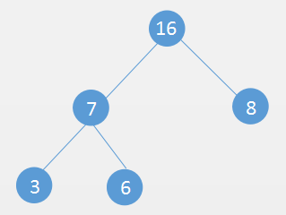

向该二叉堆插入一个元素**18**：

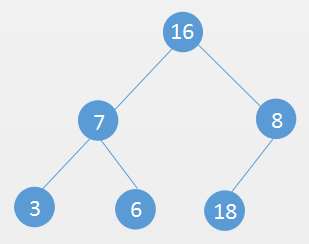

插入后发现当前的二叉树不符合二叉堆的特性，所以需要对**18**和**8**两个元素交换位置：

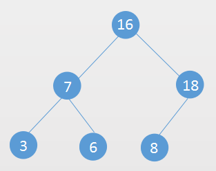

交换位置后还是不符合二叉堆的特性，需要对**18**和**16**交换位置：

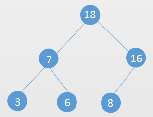

当前的二叉树就符合二叉堆的性质了，这样就完成了整个**siftUp**操作。

> 据上所述，`siftUp`操作就是先在二叉堆尾部添加元素，然后新插入的元素和父节点对比，如果不符合二叉堆特性就和父节点交换位置，然后让交换后的位置继续和它的父节点对比，直到符合二叉堆的特性。

## 移除堆顶元素(Extract)

移除堆顶元素需要对二叉堆进行 **siftDown** 操作(也称为bubble-down, percolate-down, sift-down, trickle down, heapify-down, cascade-down, and extract-min/max)

依然以上面的大顶堆为例：

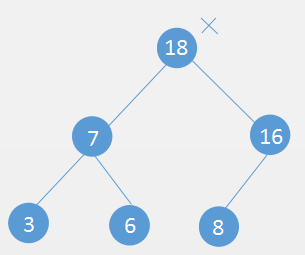

使用二叉树的最后一个节点 **8** 替换二叉树的根节点 **18** (要删除的节点)

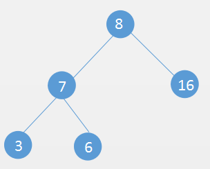

新的根节点和它的子节点对比，看是否符合二叉堆的性质，发现根节点没有它的右子节点大，与其交换位置：

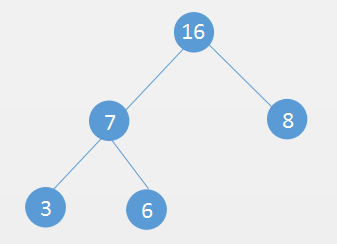

到此，当前的二叉树就符合二叉堆的性质了，这就是整个siftDown过程。

> 据上所述，siftDown操作是让新的根节点往下和它的左右节点对比， 如果不符合二叉堆特性则交换位置，然后让交换后的位置继续和它的左右子节点对比，直到符合二叉堆的特性。


## 数组转成二叉堆(Heapify)

把一个数组转成二叉堆有两种方法：

- 对每个元素`add`进二叉堆
- 对数组进行`heapify`操作

对每个元素add进二叉堆很简单，只要遍历数组，然后调用二叉堆的add方法即可。

`heapify`操作主要是把数组当成二叉堆，然后对二叉堆的非叶子节点（从二叉堆的最后一个非叶子节点开始）进行siftDown操作。

假设有一个数组 [3 , 7 ,  5 ,  9 ,  4 ,  8]，需要对其转成二叉堆(大顶堆)

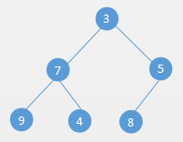


从最后一个非叶子节点开始对其**siftDown**操作：

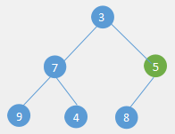


发现**5**比**8**小，交换位置：

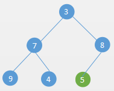


然后对倒数第二个非叶子节点进行**siftDown**操作：

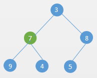

发现**7**比**9**小，交换位置：

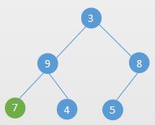

最后对倒数第三个非叶子节点siftDown操作：

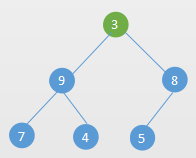

发现**3**比**9**小，交换位置：

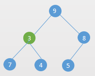

交换位置后，发现**3**比**7**小，继续交换位置：

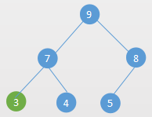

最终完成了 `heapify` 操作。


# 构建大顶堆和小顶堆

```java
//大顶堆
public class MaxHeap<T extends Comparable<T>> {

    private T[] data;
    private int size;

    public MaxHeap() {
        this(16);
    }

    public MaxHeap(int capacity) {
        data = (T[]) new Comparable[capacity];
    }

    //Heapify
    public MaxHeap(T[] arr) {
        data = arr;
        size = arr.length;
        //对所有非叶子节点进行siftDown操作，从倒数第一个非叶子节点开始
        for (int i = getParent(data.length - 1); i >= 0; i--) {
            siftDown(i);
        }
    }

    public int size() {
        return size;
    }

    public boolean isEmpty() {
        return size == 0;
    }

    public void clear() {
        size = 0;
        Arrays.fill(data, null);
    }

    public int getParent(int index) {
        if (index == 0) {
            return -1;
        }
        return (index - 1) / 2;
    }

    public int getLeft(int index) {
        return index * 2 + 1;
    }

    public int getRight(int index) {
        return index * 2 + 2;
    }

    public void add(T element) {
        data[size++] = element;
        if (size == data.length) {
            doubleCapacity();
        }
        siftUp(size - 1);
    }

    private void doubleCapacity() {
        data = Arrays.copyOf(data, data.length << 1);
    }

    private void swap(int i, int j) {
        T tmp = data[i];
        data[i] = data[j];
        data[j] = tmp;
    }

    private void siftUp(int index) {
        int parentIndex;
        //如果当前的节点比父节点要大
        while (index > 0 && data[index].compareTo(data[parentIndex = getParent(index)]) > 0) {
            swap(index, parentIndex);
            index = parentIndex;
        }
    }

    /**
     * 移除堆中最大元素
     */
    public T removeMax() {
        if (size == 0)
            throw new NoSuchElementException();

        T delete = getMax();
        swap(0, size - 1);
        data[--size] = null;

        siftDown(0);

        return delete;
    }

    private void siftDown(int index) {
        int left;
        while ((left = getLeft(index)) < size) {
            int max = left;
            //有右节点并且右节点大于左节点
            if (left + 1 < size && data[left + 1].compareTo(data[left]) > 0) {
                max = left + 1;
            }
            if (data[max].compareTo(data[index]) <= 0) {
                break;
            }
            swap(index, max);
            index = max;
        }
    }

    /**
     * 删除最大值，插入新元素
     *
     * @param element max
     * @return
     */
    public T replace(T element) {
        T max = getMax();
        data[0] = element;
        siftDown(0);
        return max;
    }

    public T getMax(){
        if(size==0)
            throw new NoSuchElementException();
        return data[0];
    }
}
```

下面是一组对一个数组进行heapify操作和对数组的元素一个个add进二叉堆的性能对比：

```text
//10万个数据
without heapify: 0.20134547 sec
with    heapify: 0.28973186 sec

//100万个数据
without heapify: 2.54230192 sec
with    heapify: 0.78025752 sec

//1000万个数据
without heapify: 46.96635561 sec
with    heapify: 2.81621934 sec
```

实现大顶堆和小顶堆的主要逻辑是一样的，只要在大顶堆的基础上对siftUp和siftDown的时候判断条件改下即可。例如如果是要构成小顶堆，siftUp的条件是当前节点比父节点小；siftDown的条件是当前节点比它的子节点要大。

由于篇幅的原因，我就不把小顶堆的代码贴出来了，感兴趣的可以在我的github上查看。文章末尾会给出源码地址。

# 优先队列的基本概念

优先队列首先也是一个队列。普通的队列是先进先出的，优先队列不一样，优先队列出队的时候让优先级高的先出队。当然，我们也可以把普通的队列当做一个优先队列来看，先入队的优先级高。

这样的话，我们可以通过二叉堆来很方便的实现一个优先队列。


# 实现一个优先队列

上面我们实现了二叉堆，基于二叉堆可以非常方便的实现优先队列。

```java
public class PriorityQueue<T extends Comparable<T>> implements Queue<T> {

    private MaxHeap<T> maxHeap;

    public PriorityQueue() {
        this.maxHeap = new MaxHeap<>();
    }


    @Override
    public void enqueue(T element) {
        maxHeap.add(element);
    }

    @Override
    public T dequeue() {
        return maxHeap.removeMax();
    }

    @Override
    public T getFront() {
        return maxHeap.getMax();
    }

    @Override
    public boolean isEmpty() {
        return maxHeap.isEmpty();
    }

    @Override
    public int size() {
        return maxHeap.size();
    }

    @Override
    public void clear() {
        maxHeap.clear();
    }
}
```

上面我们是通过一个大顶堆来实现一个优先队列，当然也可以通过小顶堆来实现一个优先队列。

优先级这个可以我们人为的来定。比如有一个关于学生的优先队列，学生的成绩高先出队。

如果用大顶堆的话，我们定义成绩高的优先级高。

如果用小顶堆的话，我们定义成绩高的反而优先级低，这样的话在`siftDown`和`siftUp`的时候能让成绩高的在堆顶。


# Java PriorityQueue源码分析

Java 里的优先队列 `PriorityQueue` 也是基于二叉堆实现的，和我们上面的实现方式很像。如果已经掌握了上面的二叉堆，对于 `Java PriorityQueue` 是掌握是很简单的，没有特别需要阐明的技术点。
有需要的读者最好结合二叉堆自己看下 **Java PriorityQueue** 的源码。

主要也是在 **构造方法** 中对集合进行 **heapify** 操作：

```java
public PriorityQueue(Collection<? extends E> c) {
	//如果是已经排好序的 Set
	if (c instanceof SortedSet<?>) {
		SortedSet<? extends E> ss = (SortedSet<? extends E>) c;
		this.comparator = (Comparator<? super E>) ss.comparator();
		initElementsFromCollection(ss);
	}
	//如果参数本身就是 PriorityQueue
	else if (c instanceof PriorityQueue<?>) {
		PriorityQueue<? extends E> pq = (PriorityQueue<? extends E>) c;
		this.comparator = (Comparator<? super E>) pq.comparator();
		initFromPriorityQueue(pq);
	}
	//其他情况均通过 heapify 初始化数据
	else {
		this.comparator = null;
		initFromCollection(c);
	}
}

private void initFromCollection(Collection<? extends E> c) {
	initElementsFromCollection(c);
	heapify(); //heapify 操作
}
```

在 **插入** 的时候执行 **siftUp** 操作：

```java
public boolean offer(E e) {
	if (e == null)
		throw new NullPointerException();
	modCount++;
	int i = size;
	if (i >= queue.length)
		grow(i + 1);
	size = i + 1;
	if (i == 0)
		queue[0] = e;
	else
		siftUp(i, e); //siftUp 操作
	return true;
}
```

**删除** 的时候执行 **siftDown** 操作:

```java
public E poll() {
	if (size == 0)
		return null;
	int s = --size;
	modCount++;
	E result = (E) queue[0];
	E x = (E) queue[s];
	queue[s] = null;
	if (s != 0)
		siftDown(0, x); //siftDown 操作
	return result;
}
```

> 需要注意的是 `Java PriorityQueue` 默认是一个 `小顶堆(按自然排序)`。我们上面实现的二叉堆要么是大顶堆，要么是小顶堆，`Java PriorityQueue` 支持传递比较器，所以它支持通过定制 `比较器(Comparator)`，把 `Java PriorityQueue` 构造成一个 `大顶堆`，这样更加灵活的定制优先级。

