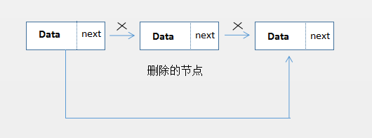
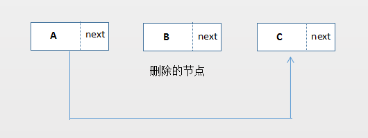
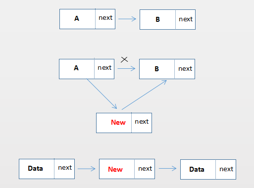
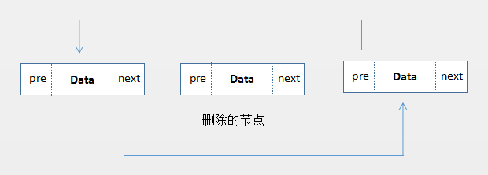
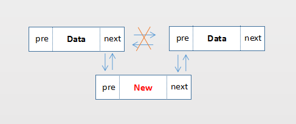

# 前言

上一篇文章`《ArrayList、Vector源码剖析》`中介绍了线性表的顺序存储和 `ArrayList` 的实现细节，这一篇主要介绍`线性表链式存储`。我们知道线性表的顺序存储需要一块连续的内存空间（数组）来存储元素。

`链式存储`是采用一组地址任意的存储单元来存放元素，也就是说存放地址的空间不用是连续的。这样可以充分利用计算机的内存空间，实现灵活的内存动态管理。

从上一篇文章我们知道线性表元素之间存在"一对一"的关系，即除了第一个和最后一个数据元素之外，其它数据元素都是首尾相接的（注意循环链表也是线性结构，但是它首尾是相接的），那么链式存储的线性表里的元素也必须满足这个特性。

由于链式存储的线性表不是按照线性的逻辑顺序来存储元素，它需要在每个元素里额外保存一个引用（用于指向下一个元素），这样就形成了"一对一"的关系。

如果链表元素中只保存了下一个元素的引用，我们称之为单向链表。相应地，如果元素中既保存了下一个元素的引用，又保存了上一个元素的引用称之为双向链表。

我们把链表中存放的元素称之为节点，单向链表由数据和下一个元素的引用两部分组成。双向链表由数据、上一个元素的引用和下一个元素的引用三部分组成。


单向链表单节点:


双向链表单个节点:


# 单向链表

单向链表元素之间的组织形式:


单向链表删除节点操作:



为了便于描述把上面三个节点称之为A、B、C，要删除的节点为B。要完成删除操作，需要维护节点引用即可：把B前一个节点A的next指向C节点，然后把要删除的B节点的next置为null。如下图所示:





这样就完成了删除节点的操作，如果是删除头节点只需要把头结点的next置为null，如果是删除尾节点，只需要把尾节点的上一个节点的next置为null。


单向链表添加节点操作（往A和B之间插入一个新节点）：





> 小结：对于单向链表，在头部或者尾部添加或删除操作只需要维护一个引用，如果是在中间添加或删除操作需要维护两个引用，如果是对头部操作，需要维护下head节点。

首先来看看单向链表用代码如何实现。

同样的我们实现了List接口：

```java
public interface List<T> extends Iterable<T> {
    void add(T t);
    void add(int index, T t);
    T get(int index);
    int indexOf(T t);
    boolean remove(T t);
    T remove(int index);
    void clear();
    int size();
}
```

额外的，针对链表还增加了`addFirst、addLast、removeFirst`和`removeLast`方法。

```java
public class LinkedList<T> implements List<T> {

    private int size;

    private Node head;
    private Node tail;

    @Override
    public Iterator<T> iterator() {
        return new MyIterator();
    }

    private class MyIterator implements Iterator<T> {

        private Node current = head;

        public boolean hasNext() {
            return current != null;
        }

        public T next() {
            T element = current.element;
            current = current.next;
            return element;
        }
    }


    /**
     * 用于保存每个节点数据
     */
    private class Node {
        T element;
        Node next;

        Node(T element, Node next) {
            this.element = element;
            this.next = next;
        }
    }

    /**
     * 检查是否越界
     *
     * @param index
     * @param size
     */
    private void checkIndexOutOfBound(int index, int size) {
        if (index < 0 || index > size) {
            throw new IndexOutOfBoundsException("index large than size");
        }
    }

    /**
     * 采用尾插法  插入新节点
     *
     * @param t
     */

    @Override
    public void add(T t) {
        addLast(t);
    }

    @Override
    public void add(int index, T t) {
        checkIndexOutOfBound(index, size);
        if (head == null) {
            add(t);
        } else {
            if (index == 0) {
                addFirst(t);
            } else {
                Node prevNode = getNode(index - 1);
                prevNode.next = new Node(t, prevNode.next);
                size++;
            }
        }
    }

    public void addLast(T t) {
        //空链表
        if (head == null) {
            //首尾都指向新的节点
            tail = head = new Node(t, null);
        } else {
            Node newNode = new Node(t, null);
            //让尾部的next指向新的节点
            tail.next = newNode;
            //把尾部设置为新的节点
            tail = newNode;
        }
        size++;

    }

    /**
     * 采用头插法 插入新节点
     *
     * @param element
     */
    public void addFirst(T element) {
        head = new Node(element, head);
        if (tail == null) {
            tail = head;
        }
        size++;
    }

    /**
     * 根据索引获取节点
     *
     * @param index
     * @return
     */
    private Node getNode(int index) {
        checkIndexOutOfBound(index, size - 1);
        Node current = head;
        for (int i = 0; i < size; i++, current = current.next) {
            if (index == i) {
                return current;
            }
        }
        return null;
    }

    @Override
    public T get(int index) {
        Node node = getNode(index);
        if (node != null) {
            return node.element;
        }
        return null;
    }

    @Override
    public int indexOf(T t) {
        Node current = head;
        for (int i = 0; i < size; i++, current = current.next) {
            if (t == null && current.element == null) {
                return i;
            }
            if (t != null && t.equals(current.element)) {
                return i;
            }
        }
        return -1;
    }

    /**
     * 删除尾节点
     *
     * @return element
     */
    public T removeLast() {
        Node delete = tail;
        if (delete == null) {
            throw new NoSuchElementException();
        }
        //如果当前只有一个节点
        if (delete == head) {
            head = tail = null;
        } else {
            //因为是单向链表，无法直接获取最后节点的上一个节点
            Node pre = getNode(size - 2);
            //解除引用
            pre.next = null;
            //重新设置tail节点
            tail = pre;
        }
        size--;
        return delete.element;
    }

    /**
     * 删除头节点
     *
     * @return element
     */
    public T removeFirst() {
        if (head == null) {
            throw new NoSuchElementException();
        }
        Node delete = head;
        //如果当前只有一个节点
        if (delete == tail) {
            head = tail = null;
        } else {
            //重新设置header节点
            head = delete.next;
            //解除被删除元素的next引用
            delete.next = null;
        }
        size--;
        return delete.element;
    }

    @Override
    public boolean remove(T t) {
        int index = indexOf(t);
        if (index == -1) {
            return false;
        }
        remove(index);
        return true;
    }

    @Override
    public T remove(int index) {
        checkIndexOutOfBound(index, size - 1);
        Node delete;
        //如果删除的是头部
        if (index == 0) {
            return removeFirst();
        } else {
            Node pre = getNode(index - 1);
            //待删除的节点
            delete = pre.next;
            //解除待删除节点和它前一个节点的引用
            pre.next = delete.next;
            //解除待删除节点和下一个节点的引用
            delete.next = null;
        }
        size--;
        return delete.element;
    }

    @Override
    public void clear() {
        head = null;
        tail = null;
        size = 0;
    }

    @Override
    public int size() {
        return size;
    }

    @Override
    public String toString() {
        if (size == 0) {
            return "[]";
        }
        StringBuilder builder = new StringBuilder();
        builder.append("head [");
        Node current = head;
        while (current != null) {
            builder.append(current.element).append("->");
            current = current.next;
        }
        builder.append("null] tail");
        return builder.toString();
    }
}
```


从上面的代码可以看出，如果根据索引来添加、删除节点，时间复杂度为`O(N)`，需要遍历链表。删除链表的头元素（removeFirst）时间复杂度为`O(1)`，但是对于我们单向链表的`removeLast`时间复杂度是`O(N)`，因为单向列表只保存了下一个元素的引用，无法获取上一个元素，需要遍历才能获取被删除节点的上一个节点，这个时候就需要双向链表。


# 双向链表

双向链表组织形式：


删除中间一个元素：




往中间添加元素：




双向链表和单向链表类似，只不过要多维护一个引用（前一个元素的引用），每个节点既可以向前引用，也可以向后引用。

双向链表删除最后一个节点（removeLast），不用像单向链表用遍历的方式获取前一个节点，它可以直接拿到上一个节点的引用。

双向链表根据索引`index`指定位置查找、添加、删除更加高效。单向链表根据索引查找的时候，需要从头节点开始遍历，如果有`100`个节点，用户需要查找`index=99`位置的节点，需要遍历`100`次，才能找到这个节点。如果是双向链表，可以从尾节点开始遍历，只需要判断`index`是否大于`size/2`，也就是说如果`index`是在链表的后半部分，那就从尾节点向头结点方向遍历，如果链表有`100`节点，访问`index=99`的节点，只需要循环一次就找到了。代码如下所示：

```java
    private Node getNodeFast(int index) {
        checkIndexOutOfBound(index, size - 1);
		//如果在链表的后半部分
        if (index > size / 2) {
            Node current = tail;
            for (int i = size - 1; i >= 0; i--, current = current.prev) {
                if (index == i) {
                    return current;
                }
            }
        } else {
            //从头节点向尾节点方向遍历
            return getNode(index);
        }
        return null;
    }
```

我们来看看JDK中LinkedList是怎么做的：

```java
    Node<E> node(int index) {
        // assert isElementIndex(index);
        if (index < (size >> 1)) {
            Node<E> x = first;
            for (int i = 0; i < index; i++)
                x = x.next;
            return x;
        } else {
            Node<E> x = last;
            for (int i = size - 1; i > index; i--)
                x = x.prev;
            return x;
        }
    }
```

它这个比我们写的要巧妙一些，在`for`循环中，不需要判断 `index` 和 `i` 是否相等，把`index`作为循环的边界值，最后一次循环就是我们要找的值。

下面展示我们实现的双向链表 `DuplexLinkedList` 代码：

```java
public class DuplexLinkedList<T> implements List<T> {

    private int size;

    private Node head;
    private Node tail;

    @Override
    public Iterator<T> iterator() {
        return new MyIterator();
    }

    private class MyIterator implements Iterator<T> {

        private Node current = head;

        public boolean hasNext() {
            return current != null;
        }

        public T next() {
            T element = current.element;
            current = current.next;
            return element;
        }
    }


    /**
     * 用于保存每个节点数据
     */
    private class Node {
        T element;
        Node prev;
        Node next;

        Node(T element, Node next, Node prev) {
            this.element = element;
            this.next = next;
            this.prev = prev;
        }

        @Override
        public String toString() {
            return element + "";
        }
    }

    /**
     * 检查是否越界
     *
     * @param index
     * @param size
     */
    private void checkIndexOutOfBound(int index, int size) {
        if (index < 0 || index > size) {
            throw new IndexOutOfBoundsException("index large than size");
        }
    }

    /**
     * 采用尾插法  插入新节点
     *
     * @param t
     */

    @Override
    public void add(T t) {
        addLast(t);
    }

    @Override
    public void add(int index, T t) {
        checkIndexOutOfBound(index, size);
        if (head == null) {
            add(t);
        } else {
            if (index == 0) {
                addFirst(t);
            } else {
                Node prevNode = getNodeFast(index - 1);
                prevNode.next = new Node(t, prevNode.next, prevNode);
                size++;
            }
        }
    }

    public void addLast(T t) {
        //空链表
        if (head == null) {
            //首尾都指向新的节点
            tail = head = new Node(t, null, null);
        } else {
            Node newNode = new Node(t, null, tail);
            //让尾部的next指向新的节点
            tail.next = newNode;
            //把尾部设置为新的节点
            tail = newNode;
        }
        size++;

    }


    /**
     * 采用头插法 插入新节点
     *
     * @param element
     */
    public void addFirst(T element) {
        head = new Node(element, head, null);
        if (tail == null) {
            tail = head;
        }
        size++;
    }

    /**
     * 根据索引获取节点
     *
     * @param index
     * @return
     */
    private Node getNode(int index) {
        checkIndexOutOfBound(index, size - 1);
        Node current = head;
        for (int i = 0; i < size; i++, current = current.next) {
            if (index == i) {
                return current;
            }
        }
        return null;
    }


    /**
     * 如果需要查找的index节点在链表的后半部分，则从后往前遍历，否则按照顺序遍历
     *
     * @param index
     * @return
     */
    private Node getNodeFast(int index) {
        checkIndexOutOfBound(index, size - 1);
        if (index > size / 2) {
            Node current = tail;
            for (int i = size - 1; i >= 0; i--, current = current.prev) {
                if (index == i) {
                    return current;
                }
            }
        } else {
            //从头节点向尾节点方向遍历
            return getNode(index);
        }
        return null;
    }

    @Override
    public T get(int index) {
        Node node = getNodeFast(index);
        if (node != null) {
            return node.element;
        }
        return null;
    }

    @Override
    public int indexOf(T t) {
        Node current = head;
        for (int i = 0; i < size; i++, current = current.next) {
            if (t == null && current.element == null) {
                return i;
            }
            if (t != null && t.equals(current.element)) {
                return i;
            }
        }
        return -1;
    }

    @Override
    public boolean remove(T t) {
        int index = indexOf(t);
        if (index == -1) {
            return false;
        }
        remove(index);
        return false;
    }

    @Override
    public T remove(int index) {
        checkIndexOutOfBound(index, size - 1);
        Node delete;
        //如果删除的是头部
        if (index == 0) {
            return removeFirst();
        } else {
            delete = getNodeFast(index);
            Node pre = delete.prev;
            Node next = delete.next;
            pre.next = next;
            if (next != null) {
                next.prev = pre;
            } else {
                tail = pre;
            }
            delete.next = null;
            delete.prev = null;
        }
        size--;
        return delete.element;
    }

    /**
     * 删除头结点
     *
     * @return
     */
    public T removeFirst() {
        if (head == null) {
            throw new NoSuchElementException();
        }
        Node delete = head;
        if (head == tail) {
            head = tail = null;
        } else {
            Node next = delete.next;
            next.prev = null;
            delete.next = null;
            head = next;
        }
        size--;
        return delete.element;
    }


    /**
     * 删除尾节点
     *
     * @return
     */
    public T removeLast() {
        if (tail == null) {
            throw new NoSuchElementException();
        }
        Node delete = tail;
        //如果只有一个元素
        if (head == tail) {
            head = tail = null;
        } else {
            Node pre = delete.prev;
            pre.next = null;
            delete.prev = null;
            tail = pre;
        }
        size--;
        return delete.element;
    }

    @Override
    public void clear() {
        head = null;
        tail = null;
        size = 0;
    }

    @Override
    public String toString() {
        if (size == 0) {
            return "[]";
        }
        StringBuilder builder = new StringBuilder();
        builder.append("head [");
        Node current = head;
        while (current != null) {
            builder.append(current.element).append("->");
            current = current.next;
        }
        builder.append("null] tail");
        return builder.toString();
    }

    @Override
    public int size() {
        return size;
    }
}
```


# JDK LinkedList

`JDK LinkedList`底层也是用链表实现的，`LinkedList` 还是个`双端队列`（既可以当做栈使用，也可以当做队列使用）。关于双向链表部分`LinkedList`和我们上面实现的双向列表链表非常类似。至于双端队列部分放到后面单独来介绍。


# 小结

链表在插入、删除元素比顺序存储的线性表要快，但是失去了随机访问的能力，所以在查找一个节点或者根据"索引"来访问某个元素要比顺序存储的线性表要慢。 
其实不管是单向链表还是双向链表，只要在脑海中形成链表的组织形式，对它们的增删改查就很简单，第一个是维护好引用，第二个是维护好头结点和尾节点。
