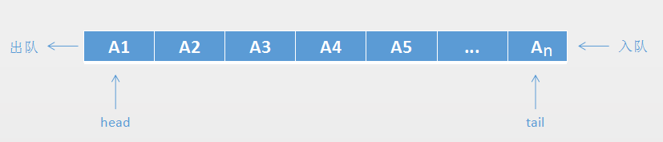
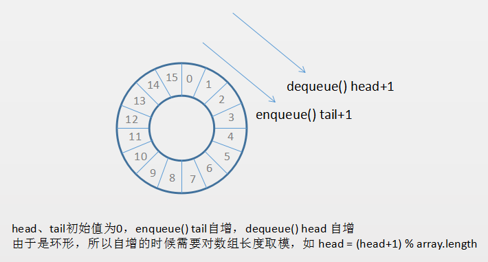
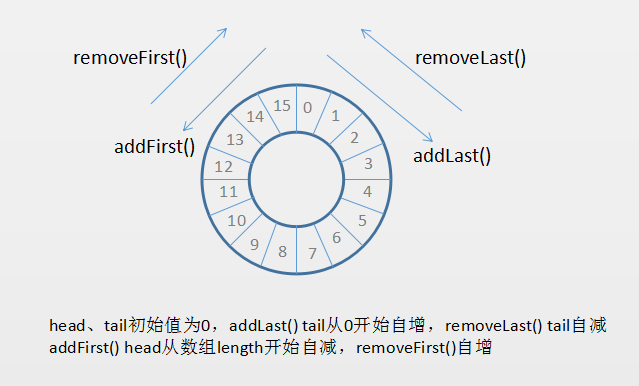
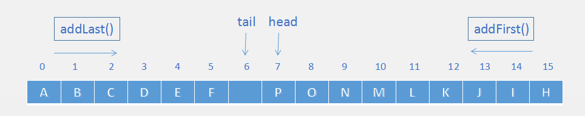
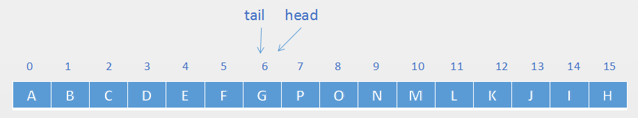
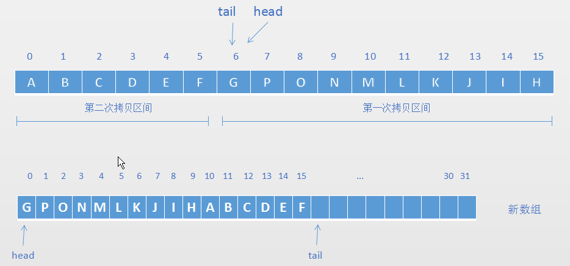
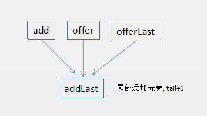
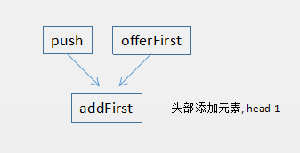
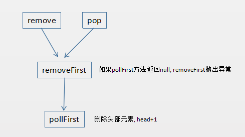
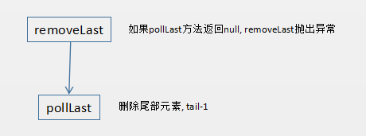

# 前言

如果对`队列`的基本概念、相关操作、顺序存储链式存储、循环队列等比较熟悉，可以跳过前半部分，直接从`Java ArrayDeque`源码部分开始，这也是本文的重点。

为了介绍队列的时候的连贯性，所以从队列的最基础的部分开始介绍。

先自己实现一遍队列，然后对比 java.util.ArrayDeque 的实现。


# 队列基本概念

队列和栈一样，也是一个被限制的线性表。

上次介绍的栈，入栈和出栈都是在栈顶进行操作，而队列是在队列头部进行删除，在队列的尾部进行插入操作。

这就类似于我们去银行排队一样，柜台的一端称之为队列头部（head），后面排队的称之为队列尾部（tail），来了客户往尾部添加，柜员服务完一个客户删除该客户。在队列中添加操作称之为入队（enqueue），删除操作称之为出队（dequeue）。

如下图所示：




# 队列的相关操作

队列常用操作

1. 入队
2. 出队
3. 访问队列头部元素但不删除
4. 队列元素个数
5. 队列是否为空
6. 清空队列

可以将以上操作定义为一下几个方法：

```text
void enqueue(T element)    //入队
T dequeue()                //出队
T getFont()                //获取队列头部元素
int size();                //返回队列元素个数
void clear()               //清空队列
```

为了方便后面介绍的`ArrayDeque`双端队列，在上面几个方法的基础上加上`removeFirst()、removeLast()、addFirst()、addLast()`方法。因为双端队列可以在尾部添加和删除，也可以在头部添加和删除。

## 简易的顺序存储的队列

简易版的顺序存储的的队列，实现很简单，入队往数组尾部添加元素，出队把数组的第一个元素移除即可，然后把数组元素整体往左移动一个位置。

```java
public class SimpleArrayQueue<T> implements Queue<T> {

    private T[] data;
    private int size;

    public SimpleArrayQueue(int initialSize) {
        data = (T[]) new Object[initialSize];
    }

    @Override
    public void enqueue(T element) {
        data[size++] = element;
        if (size >= data.length) {
            doubleCapacity();
        }
    }

    private void doubleCapacity() {
        data = Arrays.copyOf(data, data.length << 1);
    }

    @Override
    public T dequeue() {
        if (size == 0) {
            throw new NoSuchElementException();
        }
        T d = data[0];
        data[0] = null;
        System.arraycopy(data, 1, data, 0, --size);
        return d;
    }

    @Override
    public T getFront() {
        if (size == 0) {
            throw new NoSuchElementException();
        }
        return data[0];
    }

    @Override
    public int size() {
        return size;
    }

    @Override
    public boolean isEmpty() {
        return size == 0;
    }
    
    public void clear() {
        Arrays.fill(data, null);
        size = 0;
    }
}
```

出队的时候，把数组索引为`0`的元素置为`null`，然后数组的元素整体往左移动，这样队列出队的时间复杂度就为`O(N)`，那么有什么办法让队列出队操作的时间复杂度是`O(1)`呢？ 
一个是使用链表实现队列，一个是使用循环队列。下面我们就来介绍下顺序存储的循环队列的实现。

## 顺序存储的循环队列

循环队列的原理图（数字代表索引）：



循环队列的代码实现：

```java
public class LoopArrayQueue<T> implements Queue<T> {

    private int head, tail;
    private int size;
    private T[] data;

    public LoopArrayQueue() {
        this(16);
    }

    public LoopArrayQueue(int initialSize) {
        data = (T[]) new Object[initialSize];
    }


    @Override
    public void enqueue(T element) {
        data[tail] = element;
        tail = (tail + 1) % data.length;
        size++;
        if (tail == head) {
            doubleCapacity();
        }
    }

    @Override
    public T dequeue() {
        if (size == 0) {
            throw new NoSuchElementException();
        }
        data[head] = null;
        T v = data[head];
        head = (head + 1) % data.length;
        size--;
        return v;
    }

    private void doubleCapacity() {
        T[] newData = (T[]) new Object[data.length << 1];
        for (int i = 0; i < size; i++) {
            newData[i] = data[(head + i) % data.length];
        }
        data = newData;
        head = 0;
        tail = size;
    }

    @Override
    public T getFront() {
        if (size == 0) {
            throw new NoSuchElementException();
        }
        return data[head];
    }

    @Override
    public boolean isEmpty() {
        return size == 0;
    }

    @Override
    public int size() {
        return size;
    }

    @Override
    public void clear() {
        Arrays.fill(data, null);
        tail = head = 0;
        size = 0;
    }

    public int getCapacity() {
        return data.length;
    }
}
```

这样就可以利用循环队列让出队操作的时间复杂度为`O(1)`，更加高效。


## 队列的链式存储

因为以前讲过 [线性表的链式存储](mks/collections/LinkedList.md) 队列的链式存储就很简单了，直接把`add`方法当做`enqueue`操作，`removeFirst` 当做`dequeue`操作。

```java
public class LinkedQueue<T> implements Queue<T>{

    private class Node {

        private T element;
        private Node next;

        public Node(T element, Node next) {
            this.element = element;
            this.next = next;
        }
    }

    private Node head;
    private Node tail;
    private int size;

    public LinkedQueue() {

    }

    public LinkedQueue(T element) {
        tail = head = new Node(element, null);
        size++;
    }

    @Override
    public int size() {
        return size;
    }

    @Override
    public void enqueue(T element) {
        if (element == null) {
            throw new NullPointerException();
        }
        if (head == null) {
            tail = head = new Node(element, null);
        } else {
            Node newNode = new Node(element, null);
            tail.next = newNode;
            tail = newNode;
        }
        size++;
    }
    @Override
    public T dequeue() {
        Node oldFront = head;
        head = oldFront.next;
        oldFront.next = null;
        size--;
        return oldFront.element;
    }

    @Override
    public T getFront() {
        if(head==null)
            throw new NoSuchElementException();
        return head.element;
    }

    @Override
    public boolean isEmpty() {
        return size == 0;
    }

    @Override
    public void clear() {
        tail = head = null;
        size = 0;
    }
}
```


# Java LinkedList中的双端队列

`LinkedList` 实现了 `java.util.Deque` 接口 是一个双端队列。`Deque` 是`Double Ended Queue`的缩写，意思是双端队列。双端队列既可以在头部插入和删除，可以在尾部插入和删除。所以双端队列既可以当做栈使用，也可以当做队列使用。

`LinkedList`是基于链表实现的 ，所以很容易实现在两端进行插入和删除操作（removeFirst、removeLast、addFirst、addLast）。

关于`LinkedList`进行过介绍，可以查看之前的文章:

- [链式存储及 LinkedList 源码解析](mks/collections/LinkedList.md)
- [栈和 Java Stack 源码分析](mks/collections/JavaStack.md)

# Java ArrayDeque源码分析

## ArrayDeque双端队列

`ArrayDeque`和`LinkedList`都实现了Deque接口。下面看下`ArrayDeque`双端队列的使用：

```java
//ArrayDeque当做栈使用
private static void testAsStack() {
	ArrayDeque<Integer> stack = new ArrayDeque<>();
	for (int i = 0; i < 17; i++) {
		stack.push(i);
	}
	while (!stack.isEmpty()) {
		System.out.println(stack.pop());
	}
}

//ArrayDeque当做队列使用
private static void testAsQueue() {
	ArrayDeque<Integer> queue = new ArrayDeque<>();
	for (int i = 0; i < 10; i++) {
		queue.addLast(i);
	}
	while (!queue.isEmpty()) {
		System.out.println(queue.removeFirst());
	}
}
```

## ArrayDeque循环队列

`ArrayDeque`的插入和删除操作主要通过`addFirst、addLast、removeFirst、removeLast`方法。
`ArrayDeque`作为队列使用时，`addLast`方法相当于`enqueue`操作，`removeFirst`相当于`dequeue`操作。addLast方法里会对`tail+1，removeFirst`方法里会对`head+1`

`addLast` 方法插入元素是从数组 `index=0` 的位置从左往右依次插入
`addFirst` 方法插入元素是从数组 `index=length-1` 的位置从右往左开始插入

`ArrayDeque`默认构造方法会创建一个大小为`16`的数组。

`ArrayDeque`是循环队列，把它当做一个环来看更容易理解。插入和删除操作的原理示意图（数字代表索引）：




## 位运算与取模（%）

上面实现的 `LoopArrayQueue` 循环队列，使用采用取余的方式来实现循环队列的，每次通过`head`或者`tail`作为下标获取数组元素的时候都需要对数组长度取余。

来看下`java.util.ArrayDeque`是怎么实现循环队列的：

```java
public void addFirst(E e) {
	//省略无关代码
	head = (head - 1) & (elements.length - 1)
}

public void addLast(E e) {
	//省略无关代码
	tail = (tail + 1) & (elements.length - 1)
}

public E pollFirst() {
	//省略无关代码
	head = (h + 1) & (elements.length - 1);
}

public E pollLast() {
	tail = (tail - 1) & (elements.length - 1);
	//省略无关代码
}
```

可以知道`ArrayDeque`是通过位运算来实现循环队列的，这个技巧在Java 集合框架中应用很多，比如`HashMap`。

关系如下：`X % 2^n = X & (2^n – 1)`

也就是说 用位运算`&`来取代`%`取模需要被取模的数必须是`2的幂才`成立，如：

```text
n % 4 = n & 3
n % 8 = n & 7
```

我对%和&进行了一个简单的性能测试，对 0~Integer.MAX 所有的数分别%和& ，消耗的时间如下：

```text
 % time: 1.847528994 sec
 & time: 0.00163733 sec
```

## ArrayDeque扩容机制

ArrayDeque默认构造函数会初始化容量为16（2^4）的数组，也支持在构造的时候传递容量参数：

```java
public ArrayDeque(int numElements) {
	allocateElements(numElements);
}

private void allocateElements(int numElements) {
	int initialCapacity = MIN_INITIAL_CAPACITY;
	if (numElements >= initialCapacity) {
		initialCapacity = numElements;
		initialCapacity |= (initialCapacity >>>  1);
		initialCapacity |= (initialCapacity >>>  2);
		initialCapacity |= (initialCapacity >>>  4);
		initialCapacity |= (initialCapacity >>>  8);
		initialCapacity |= (initialCapacity >>> 16);
		initialCapacity++;

		if (initialCapacity < 0)   // Too many elements, must back off
			initialCapacity >>>= 1;// Good luck allocating 2 ^ 30 elements
	}
	elements = new Object[initialCapacity];
}
```
如果传递进来的容量小于默认容量8，则使用默认容量。传递进来的参数可能不是2幂，需要对其进行5次右移和或操作保证最终的容量大小是2的幂。从而达到支持位运算来替换取模的目的。

> `>>>` 运算符把 number 的各个位向右移 n 位数，右移后左边空出的位用零来填充，移出右边的位被丢弃。

假设传递进来的容量为 13 ，过程如下：

```text
00001101                      13
00001111      n | n >>> 1     15
00001111      n | n >>> 2     15
00001111      n | n >>> 4     15
00001111      n | n >>> 16    15     2^k-1
```

把最终的值加上1就是`16(2^4)`. 因为比13大且离13最近的2的幂的数 就是16
像这样的位运算技巧很多，有空后面单独一篇文章来介绍。

ArrayDeque的扩容时机为 tail = head 的时候，扩容的容量为原来的两倍。代码如下：

```java
private void doubleCapacity() {
	assert head == tail;
	int p = head;
	int n = elements.length;
	int r = n - p; // number of elements to the right of p
	int newCapacity = n << 1;
	if (newCapacity < 0)
		throw new IllegalStateException("Sorry, deque too big");
	Object[] a = new Object[newCapacity];
	System.arraycopy(elements, p, a, 0, r);
	System.arraycopy(elements, 0, a, r, p);
	elements = a;
	head = 0;
	tail = n;
}
```

我们在实现`LoopArrayDeque`的时候使用一个简单的`for`循环完成了对数据的`copy`

`ArrayDeque`使用了更加高效的 `System.arraycopy` 方法，为什么需要两次 `System.arraycopy` 因为循环队列总共有两个部分需要拷贝，下面用图来展示下扩容的过程，假设有如下`ArrayDeque`（默认容量16）



然后调用 addFirst("G") ：


此时 head 和 tail 相等，触发扩容操作，新创建一个大小为16*2的新数组，然后通过两次拷贝。

一次拷贝是把数组的后部分数据也就是从 head 到 数组长度-1的位置拷贝到新数组的前半部分；

还有一次拷贝是把剩余的数据0到tail-1的位置拷贝到新数组，如下图所示：



## ArrayDeque方法总结

`ArrayDeque`类里的方法很多， 其实主要掌握把`ArrayDeque`当栈使用的时候该用哪些方法；
当做队列用该使用哪些方法就Ok。
但是，如果其他人在代码中使用别的方法也要看得懂，所以特地对该类的方法做一个总结和归纳。

### 插入相关的方法
`add()、offer()、offerLast()`底层均是调用了`addLast`，如下图所示：



offerFirst()、push()方法均是调用了addFirst()方法，如下图所示：



需要注意的是，`ArrayDeque`不支持插入`null`元素，否则会抛出空指针异常。

### 删除相关的方法

remove()、pop()  ->  removeFirst()  ->  pollFirst()




removeLast()：实际是调用`pollLast`方法，如下图所示：




> 总结，调用或间接`removeXXX`相关方法，如果目标元素为空，则抛出异常`pollXXX方`法，如果目标元素为空，不会抛出异常。


### 获取元素相关方法

- peek()：获取队列头部元素，内部调用 peekFirst ()，如果元素为空，不会抛出异常
- element()：获取队列头部元素，内部调用 getFirst()  如果元素为空，抛出异常
- peekLast()：获取队列尾部元素，如果元素为空，不会抛出异常
- getLast()：获取队列尾部元素，如果元素为空，抛出异常

> 总结，peekXXX相关方法，如果目标元素为空不会抛出异常 getXXX 相关方法，如果目标元素为空，抛出异常。

# 最后

根据`ArrayDeque`文档的描述，当`ArrayDeque`当做`Stack`来使用时，它比 `java.util.Stack` 要快；当`ArrayDeque`当做`Queue`来使用，它比 `java.util.LinkedList` 要快。所以在开发中，如果需要使用栈或者队列，尽量使用ArrayDeque。至此，`java.util.ArrayDeque` 的分析就完毕了。


