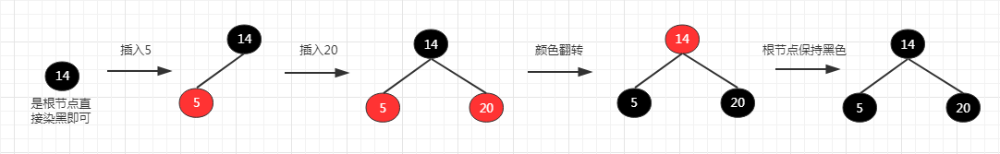

# 前言

今天我们来深入剖析下非常重要的数据结构：`红黑树`。我们将一步步来分析红黑树的由来，很多文章或书籍在介绍红黑树的时候直接上来就是红黑树的5个基本性质、插入、删除操作等。本文不是采用这样的介绍方式，在介绍红黑树之前，我们要了解红黑树是怎么发展出来的，进而就能知道为什么会有红黑树的5条基本性质。最后我们还将结合JDK中使用红黑树的集合类进行印证我们分析的红黑树。

本文比较长，花费了我很多的时间，希望对你有帮助。在介绍红黑树之前，我们先来看下`2-3树`。


# 什么是2-3树

在介绍红黑树之前为什么要先介绍 `2-3树` 呢？因为红黑树是 `完美平衡的2-3树` 的一种实现。所以，理解2-3树对掌握红黑树是至关重要的。

`2-3树` 的一个Node可能有多个子节点（可能大于2个），而且一个Node可以包含2个键(元素)

可以把 `红黑树(红黑二叉查找树)` 当作 `2-3树` 的一种二叉结构的实现。

在前面介绍的二叉树中，一个Node保存一个值，在2-3树中把这样的节点称之为 `2-` 节点

如果一个节点包含了两个`值`(可以当作两个节点的融合)，在2-3树中把这样的节点称之为 `3-` 节点。 `完美平衡的2-3树所有空链接到根节点的距离都应该是相同的`

下面看下《算法4》对 2-3-节点的定义：

- `2- 节点`，含有一个键（及其对应的值）和两条链接。该节点的左链接小于该节点的键；该节点的右链接大于该节点的键
- `3- 节点`，含有两个键（及其对应的值）和三条链接。左链接小于该节点的左键；中链接在左键和右键之间；右链接大于该节点右键

如下面一棵 `完美平衡的2-3树` ：


`2-3树` 是一棵多叉`搜索树`，所以数据的插入类似二分搜索树


# 2-3树的插入操作

红黑树是对 `完美平衡的2-3树` 的一种实现，所以我们主要介绍完美平衡的2-3树的插入过程

完美平衡的2-3树插入分为以下几种情况（为了方便画图默认把空链接去掉）：

## 向 2- 结点中插入新键


## 向一棵只含有一个3-结点的树中插入新键

因为2-3树中节点只能是2-节点或者3-节点

往3-点中再插入一个键就成了4-节点，需要对其进行分解，如下所示：


## 向一个父结点为 2- 结点的 3- 结点插入新键

往3-点中再插入一个键就成了4-节点，需要对其进行分解，对中间的键向上融合

由于父结点是一个 2- 结点 ，融合后变成了 3- 结点，然后把 4- 结点的左键变成该 3- 节点的中间子结点


## 向一个父结点为3- 结点的 3- 结点中插入新键

在这种情况下，向3- 结点插入新键形成暂时的4- 结点，向上分解，父节点又形成一个4- 结点，然后继续上分解


## 一个 4- 结点分解为一棵2-3树6种情况


# 红黑树(RedBlackTree)

## 完美平衡的2-3树和红黑树的对应关系

上面介绍完了2-3树，下面来看下红黑树是怎么来实现一棵完美平衡的2-3树的

红黑树的背后的基本思想就是用标准的二分搜索树和一些额外的信息来表示2-3树的

这额外的信息指的是什么呢？因为2-3树不是二叉树（最多有3叉），所以需要把 `3- 结点` 替换成 `2- 结点`

额外的信息就是指替换3-结点的方式

将2-3树的链接定义为两种类型：黑链接、红链接

`黑链接` 是2-3树中普通的链接，可以把2-3树中的 `2- 结点` 与它的子结点之间的链当作黑链接

`红链接` 2-3树中 `3-` 结点分解成两个 `2-` 结点，这两个 `2-` 结点之间的链接就是红链接

那么如何将2-3树和红黑树等价起来，我们规定：`红链接均为左链接`

根据上面对`完美平衡的2-3树`和`红链接`的介绍可以得出结论：`没有一个结点同时和两个红链接相连`

根据上面对`完美平衡的2-3树`和`黑链接`的介绍可以得出结论：`完美平衡的2-3树是保持完美黑色平衡的，任意空链接到根结点的路径上的黑链接数量相同`

据此，我们可以得出3条性质：
 
1. 红链接均为左链接
2. 没有一个结点同时和两个红链接相连
3. 完美平衡的2-3树是保持完美黑色平衡的，任意空链接到根结点的路径上的黑链接数量相同

在红黑树中，没有一个对象来表示红链接和黑链接，通过在结点上加上一个属性(color)来标识红链接还是黑链接，color值为red表示结点是红结点，color值为black表示结点是黑结点。

`黑结点` 2-3树中普通的 2-结点 的颜色
`红结点` 2-3树中 3- 结点 分解出两个 2-结点 的最小 2-结点

下面是2-3树和红黑树的一一对应关系图：


## 红黑树的5个基本性质的分析

介绍完了2-3树和红黑树的对应关系后，我们再来看下红黑树的5个基本性质：

1. 每个结点要么是红色，要么是黑色
2. 根结点是黑色
3. 每个叶子结点（最后的空节点）是黑色
4. 如果一个结点是红色的，那么他的孩子结点都是黑色的
5. 从任意一个结点到叶子结点，经过的黑色结点是一样的

2-3树和红黑树的对应关系后我们也就知道了红黑树的5个基本性质是怎么来的了

红黑树的第一条性质：`每个节点要么是红色，要么是黑色`

> 因为我们用结点上的属性来表示红链还是黑链，所以红黑树的结点要么是红色，要么是黑色是很自然的事情

红黑树的第二条性质：`根结点是黑色`

> 红色节点的情况是 3- 结点分解出两个 2- 结点的最小节点是红色，根节点没有父节点所以只能是黑色

红黑树的第三条性质：`每个叶子结点（最后的空节点）是黑色`

> 叶子节点也就是2-3树中的空链，如果空链是红色说明下面还是有子结点的，但是空链是没有子结点的；另一方面如果
空链是红色，空链指向的父结点结点如果也是红色就会出现两个连续的红色链接，就和上面介绍的 “没有一个结点同时和两个红链接相连” 相违背

红黑树的第四条性质：`如果一个结点是红色的，那么他的孩子结点都是黑色的`

> 上面介绍的‘没有一个结点同时和两个红链接相连’，所以一个结点是红色，那么他的孩子结点都是黑色

红黑树的第五条性质：`从任意一个结点到叶子结点，经过的黑色结点是一样的`

> 在介绍完美平衡的2-3树和黑链接我们得出的结论：‘完美平衡的2-3树是保持完美黑色平衡的，任意空链接到根结点的路径上的黑链接数量相同’， 所以从任意一个结点到叶子结点，经过的黑色结点数是一样的


## 红黑树实现2-3树过程中的结点旋转和颜色翻转

### 颜色翻转

为什么要颜色翻转(flipColor)？在插入的过程中可能出现如下情况：两个左右子结点都是红色


根据我们上面的描述，红链只允许是左链（也就是左子结点是红色）

所以需要进行颜色转换：把该结点的左右子结点设置为黑色，自己设置为黑色

```java
private void flipColor(Node<K, V> node) {
	node.color = RED;
	node.left.color = BLACK;
	node.right.color = BLACK;
}

```


### 左旋转

左旋情况大致有两种：

`结点是右子结点且是红色`


`颜色翻转后，结点变成红色且它是父结点的右子节点`


```java
private Node<K, V> rotateLeft(Node<K, V> node) {
    Node<K, V> x = node.right;
    node.right = x.left;

    x.left = node;
    x.color = node.color;

    node.color = RED;
    return x;
}

```
### 右旋转

需要右旋的情况：连续出现两个左红色链接


```java
private Node<K, V> rotateRight(Node<K, V> node) {
    Node<K, V> x = node.left;
    node.left = x.right;
    x.right = node;

    x.color = node.color;
    node.color = RED;

    return x;
}

```

## 红黑树实现2-3树插入操作

通过我们上面对红黑树和2-3树的介绍，红黑树实现2-3树插入操作就很简单了

只要满足不出现 `两个连续左红色链接`、`右红色链接`、`左右都是红色链接` 的情况就可以了

所以仅仅需要处理三种情况即可：

1. 如果出现右侧红色链接，需要左旋
2. 如果出现两个连续的左红色链接，需要右旋
3. 如果结点的左右子链接都是红色，需要颜色翻转

```java
private Node<K, V> _add(Node<K, V> node, K key, V value) {
    //向叶子结点插入新结点
	if (node == null) {
		size++;
		return new Node<>(key, value);
	}

	//二分搜索的过程
	if (key.compareTo(node.key) < 0)
		node.left = _add(node.left, key, value);
	else if (key.compareTo(node.key) > 0)
		node.right = _add(node.right, key, value);
	else
		node.value = value;

	//1,如果出现右侧红色链接，左旋
	if (isRed(node.right) && !isRed(node.left)) {
		node = rotateLeft(node);
	}

	//2,如果出现两个连续的左红色链接，右旋
	if (isRed(node.left) && isRed(node.left.left)) {
		node = rotateRight(node);
	}

	//3,如果结点的左右子链接都是红色，颜色翻转
	if (isRed(node.left) && isRed(node.right)) {
		flipColor(node);
	}
}

public void add(K key, V value) {
    root = _add(root, key, value);
    root.color = BLACK;
}

```

这样下来红黑树依然保持着它的五个基本性质，下面我们来对比下`JDK中的TreeMap的插入操作`

先按照上面的红黑树插入逻辑插入三个元素 `[14, 5, 20]`，流程如下：



使用Java TreeMap来插入上面三个元素，流程如下：


通过对比我们发现两者的插入后的结果不一样，而且`Java TreeMap`是允许左右子结点都是红色结点！

这就和我们一直在说的用完美平衡的2-3树作为红黑树实现的基础结构`相违背`了，我们一直在强调不允许右节点是红色，也不允许两个连续的红色左节点，不允许左右结点同时是红色

这也是《算法4》在讲到红黑树时遵循的。但是JDK TreeMap（红黑树）是允许右结点是红色，也允许左右结点同时是红色，Java TreeMap的红黑树实现从它的代码注释(From CLR)说明它的实现来自《算法导论》

说明《算法4》和《算法导论》中的所介绍的红黑树产生了一些“出入”，给我们理解红黑树增加了一些困惑和难度。

《算法4》在介绍红黑树之前先给我们详细介绍了2-3树，然后接着讲到完美平衡的2-3树和红黑树的对应关系(红黑树就等于完美平衡的2-3树)，让我们知道红黑树是怎么来的，根据这些介绍你自己是可以解释红黑树的的5个基本性质为什么是这样的。

而在《算法导论》中介绍红黑树的时候没有提及2-3树，直接就是红黑树的5个基本性质，以及红黑树的插入、删除操作，感觉对初学者是不太合适的，因为你不知道为什么是这样的，只是知道有这个五个性质，也许这就是为什么它叫导论的原因吧

而且在《算法4》中作者最后好像也没有明确的给出红黑树的五个基本性质，在《算法导论》中在红黑树章节一开始就贴出了5条性质，感觉像是一种递进和升华

这两本书除了对红黑树讲解的方式存在差异外，我们还发现《算法4》和《算法导论》在红黑树的实现上也是有差异的，就如我们上面插入三个元素 `[14, 5, 20]` 产生不同的结果

在解释这些差异之前，我们再来看些2-3-4树。上面提到完美平衡的2-3树和红黑树等价，更准确的说是2-3-4树和红黑树等价

### 2-3-4树

`2-3-4树` 和 `2-3树` 非常相像。2-3树允许存在 `2- 结点` 和 `3- 结点`，类似的2-3-4树允许存在 `2- 结点`、`3- 结点` 和 `4- 结点`


### 向2-结点、3-结点插入元素

向`2-结点`插入元素，这个和上面介绍的`2-3树`是一样的，在这里就不叙述了

向`3-结点`插入元素，形成一个4-结点，因为2-3-4树允许4-结点的存在，所以不需要向上分解


### 向4-结点插入元素

向4-结点插入元素，需要分解4-结点， 因为2-3-4树最多只允许存在4-结点，如：


如果待插入的4-结点，它的父结点也是一个4-结点呢？如下图的2-3-4树插入结点K：


主要有两个方案：

1. `Bayer`于1972年提出的方案：使用相同的办法去分解父结点的4-结点，直到不需要分解为止，方向是自底向上
2. `Guibas` 和 `Sedgewick`于1978年提出的方案：自上而下的方式，也就是在二分搜索的过程，一旦遇到4-结点就分解它，这样在最终插入的时候永远不会有父结点是4-结点的情况

> `Bayer`全名叫做`Rudolf Bayer（鲁道夫·拜尔）`，他在1972年发明的 `对称二叉B树（symmetric binary B-tree）` 就是 `红黑树（red black tree）` 的前身。
`红黑树` 这个名字是由 `Leo J. Guibas` 和 `Robert Sedgewick` 于1978年的一篇论文中提出来的，
对该论文感兴趣的可以查看这个链接：http://professor.ufabc.edu.br/~jesus.mena/courses/mc3305-2q-2015/AED2-13-redblack-paper.pdf

下面的图就是 `自上而下` 方案的流程图


## 2-3-4树和红黑树的等价关系

在介绍2-3树的时候我们也讲解了2-3树和红黑树的等价关系，由于2-3树和2-3-4树非常类似，所以2-3-4树和红黑树的等价关系也是类似的。不同的是2-3-4的 `4-结点` 分解后的结点颜色变成如下形式：


所以可以得出下面一棵 2-3-4 树和红黑树的等价关系图：


上面在介绍红黑树实现2-3树的时候讲解了它的插入操作：

```java
private Node<K, V> _add(Node<K, V> node, K key, V value) {
    //向叶子结点插入新结点
	if (node == null) {
		size++;
		return new Node<>(key, value);
	}

	//二分搜索的过程
	if (key.compareTo(node.key) < 0)
		node.left = _add(node.left, key, value);
	else if (key.compareTo(node.key) > 0)
		node.right = _add(node.right, key, value);
	else
		node.value = value;

	//1,如果出现右侧红色链接，左旋
	if (isRed(node.right) && !isRed(node.left)) {
		node = rotateLeft(node);
	}

	//2,如果出现两个连续的左红色链接，右旋
	if (isRed(node.left) && isRed(node.left.left)) {
		node = rotateRight(node);
	}

	//3,如果结点的左右子链接都是红色，颜色翻转
	if (isRed(node.left) && isRed(node.right)) {
		flipColor(node);
	}
}
```

我们可以很轻松的把它改成 2-3-4 的插入逻辑（`只需要把颜色翻转的逻辑提到二分搜索的前面即可`）：

```java
private Node<K, V> _add(Node<K, V> node, K key, V value) {
    //向叶子结点插入新结点
	if (node == null) {
		size++;
		return new Node<>(key, value);
	}
	
	//split 4-nodes on the way down
	if (isRed(node.left) && isRed(node.right)) {
		flipColor(node);
	}

	//二分搜索的过程
	if (key.compareTo(node.key) < 0)
		node.left = _add(node.left, key, value);
	else if (key.compareTo(node.key) > 0)
		node.right = _add(node.right, key, value);
	else
		node.value = value;

	//fix right-leaning reds on the way up
	if (isRed(node.right) && !isRed(node.left)) {
		node = rotateLeft(node);
	}

	//fix two reds in a row on the way up
	if (isRed(node.left) && isRed(node.left.left)) {
		node = rotateRight(node);
	}

}

```


```java
//使用2-3-4树插入数据 [E,C,G,B,D,F,J,A]

RB2_3_4Tree<Character, Character> rbTree = new RB2_3_4Tree<>();
rbTree.add('E', 'E');
rbTree.add('C', 'C');
rbTree.add('G', 'G');
rbTree.add('B', 'B');
rbTree.add('D', 'D');
rbTree.add('F', 'F');
rbTree.add('J', 'J');
rbTree.add('A', 'A');
rbTree.levelorder(rbTree.root);


//使用2-3树插入数据 [E,C,G,B,D,F,J,A]

RBTree<Character, Character> rbTree = new RBTree<>();
rbTree.add('E', 'E');
rbTree.add('C', 'C');
rbTree.add('G', 'G');
rbTree.add('B', 'B');
rbTree.add('D', 'D');
rbTree.add('F', 'F');
rbTree.add('J', 'J');
rbTree.add('A', 'A');
rbTree.levelorder(rbTree.root);

```

下面是 `2-3-4树` 和 `2-3树` 插入结果的对比图：


所以我们一开始用红黑树实现完美平衡的 2-3 树，左右结点是不会都是红色的
现在用红黑树实现 2-3-4 树，左右结点的可以同时是红色的，这样的红黑树效率更高。因为如果遇到左右结点是红色，就进行颜色翻转，还需要对红色的父结点进行向上回溯，因为父结点染成红色了，可能父结点的父结点也是红色，可能需要进行结点旋转或者颜色翻转操作，所以说 2-3-4 树式的红黑树效率更高。

所以回到上面我们提到《算法4》和《算法导论》在实现上的差异的问题，就很好回答了，因为《算法4》是用红黑树实现2-3树的，并不是 2-3-4 树。但是如果是用红黑树实现 2-3-4 树就和《算法导论》上介绍的红黑树一样吗？不一样。

下面继续做一个测试，分别往上面红黑树实现的 `2-3-4树` 和 `JDK TreeMap` 中插入 `[E, D, R, O, S, X]`


虽然两棵树都是红黑树，但是却不一样。并且TreeMap允许右节点是红色，在2-3-4树中最多是左右子结点同时是红色的情况，不会出现左结点是黑色，右边的兄弟结点是红色的情况，为什么会有这样的差异呢？

从上面的2-3-4树的插入逻辑可以看出，如果右节点是红色会执行左旋转操作，所以不会出现单独红右结点的情况
也就是说只会出现单独的左结点是红色的情况，我们把这种形式的红黑树称之为`左倾红黑树`（Left Leaning Red Black Tree），包括上面的红黑树实现的完美平衡的2-3树也是左倾红黑树

为什么在《算法4》中，作者规定所有的红色链接都是左链接，这只是人为的规定，当然也可以是右链接，规定红链接都是左链，可以使用更少的代码来实现黑色平衡，需要考虑的情况会更少，就如上面我们介绍的插入操作，我们只需要考虑3中情况即可。

但是一般意义上的红黑树是不需要维持红色`左倾`的这个性质的，所以为什么TreeMap是允许单独右红结点的

如果还需要维护左倾情况，这样的话就更多的操作，可能还需要结点旋转和颜色的翻转，性能更差一些，虽然也是符合红黑树的性质

介绍完了《算法4》上的红黑树，下面就来分析下一般意义上的红黑树的 `插入` 和 `删除` 操作，也就是《算法导论》上介绍的红黑树。


## 红黑树插入操作

插入操作有两种情况是非常简单的，所以在这里单独说一下：

**case 1. 如果插入的结点是根结点，直接把该结点设置为黑色，整个插入操作结束**

如下图所示：


**case 2. 如果插入的结点的父结点是黑色，也无需调整，整个插入操作结束**

如下图所示：


下面开始介绍比较复杂的情况

红黑树插入操作，我们只需要处理父结点是红色的情况，因为一开始红黑树肯定是黑色平衡的，就是因为往叶子节点插入元素后可能出现两个连续的红色的结点

> 需要注意的是，我们把新插入的结点默认设置为红色，初始的时候，正在处理的节点就是插入的结点，在不断调整的过程中，正在处理的节点会不断的变化，且叔叔、爷爷、父结点都是相对于当前正在处理的结点来说的


**case 3. 叔叔结点为红色，正在处理的节点可以是左也可以是右结点**


调整策略：由于父结点是红色，叔叔结点是红色，爷爷结点是黑色，执行颜色翻转操作
然后把当前正在处理的结点设置为爷爷结点，如果爷爷的父结点是黑色插入操作结束，如果是红色继续处理


**case 4. 叔叔结点为黑色，正在处理的结点是右结点**


调整策略：由于父结点是红色，叔叔结点为黑色，那么爷爷结点肯定是黑色
把正在处理的节点设置为父结点，然后左旋，形成Case5情况


**case 5. 叔叔结点为黑色，正在处理的结点是左孩子**


调整策略：由于父结点是红色，叔叔结点为黑色，那么爷爷结点肯定是黑色
把父结点染黑，爷爷结点染红，然后爷爷结点右旋


Case3、Case4、Case5 如果单独来理解的话比较困难，就算单独为每一个Case画图，我觉得也很难完整的理解，很多博客上都是这种方式，感觉不太好理解。我将这三种情况通过一张流程图串联起来，将这三个Case形成一个整体，蓝色箭头表示正在处理的结点，如下所示：


## 红黑树删除操作

上面介绍完了红黑树的插入操作，接下来看下红黑树的删除操作

红黑树的删除操作比插入操作更加复杂一些

为了描述方便，我们把正在处理的结点称之为 `X`，父结点为 `P`(Parent)，兄弟节点称之为 `S`(Sibling)，左侄子称之为 `LN`(Left Nephew)，右侄子称之为 `RN`(Right Nephew)

如果删除的结点是黑色，那么就导致本来保持黑平衡的红黑树失衡了，从下图可以看出结点P到左子树的叶子结点经过的黑节点数量为 `4(2+2)`，到右子树的叶子节点经过的黑色节点数量是 `5(2+3)`，如下图所示：


红黑树的删除操作，如果删除的是黑色会导致红黑树就不能保持黑色平衡了，需要进行调整了；
如果删除的是红色，那么就无需调整，直接删除即可，因为没有没有破坏黑色平衡.

删除结点后，`无需调整`的情况:

**case 1 删除的结点是红色结点，直接删除即可**

**case 2 删除的节点是黑色，如果当前处理的节点X是根结点**

无论根结点是什么颜色，都将根结点设置为黑色


**case 3 删除的结点是黑色，如果当前处理的结点是红色结点，将该结点设置为黑色**
    
因为删除黑色结点后，就打破了黑色平衡，黑高少了1，所以把一个红色节点设置为黑色，这样黑高又平衡了


删除节点后，`需要调整`的情况：

正在处理的结点为X，要删除的结点是左结点，分为下面4中情况：

**case 4 兄弟结点为红色**

调整方案：兄弟设置为黑色，父结点设置为红色，父结点进行左旋转
转化为 case5、case6、case7


**case 5 兄弟结点为黑色，左侄子LN为黑色，右侄子RN为黑色**

在这种条件下，还有两种情况：父结点是红色或黑色，不管是那种情况，调整方案都是一致的

调整方案：将兄弟结点设置为红色，把当前处理的结点设置为父结P


**case 6 兄弟结点为黑色，左侄子为红色，右侄子RN为黑色**

调整方案：将左侄子结点设置为黑色，兄弟结点设置为红色，兄弟结点右旋转，这样就转化成了case7


**case 7 兄弟结点为黑色，左侄子不管红黑，右侄子为红色**

处理方式：兄弟结点变成父结点的颜色，然后父结点设置黑色，右侄子设置黑色，父结点进行左旋转


和插入操作一样，下面通过一张流程图把删除需要调整的情况串联起来：


> 上面处理的所有情况都是基于正在处理的结点是左结点
如果要调整正在处理的结点是右节点的情况，就是上面的处理的镜像。插入操作也是同理，所以就省略了

# Java TreeMap、TreeSet源码分析

TreeMap底层就是用红黑树实现的，它在插入后调整操作主要在`fixAfterInsertion`方法里，`我为每种情况都添加注释`，如下所示：

```java
/** From CLR */
private void fixAfterInsertion(Entry<K,V> x) {
	x.color = RED;

	while (x != null && x != root && x.parent.color == RED) {
		if (parentOf(x) == leftOf(parentOf(parentOf(x)))) {
			Entry<K,V> y = rightOf(parentOf(parentOf(x)));
			//-----Case3情况-----
			if (colorOf(y) == RED) {
				setColor(parentOf(x), BLACK);
				setColor(y, BLACK);
				setColor(parentOf(parentOf(x)), RED);
				x = parentOf(parentOf(x));
			} else {
				//-----Case4情况-----
				if (x == rightOf(parentOf(x))) {
					x = parentOf(x);
					rotateLeft(x);
				}
				//-----Case5情况-----
				setColor(parentOf(x), BLACK);
				setColor(parentOf(parentOf(x)), RED);
				rotateRight(parentOf(parentOf(x)));
			}
		} else {
			//省略镜像情况
		}
	}
	root.color = BLACK;
}


它的删除后调整操作主要在`fixAfterDeletion`方法：

```java
/* From CLR */
private void fixAfterDeletion(Entry<K,V> x) {
	while (x != root && colorOf(x) == BLACK) {
		if (x == leftOf(parentOf(x))) {
			Entry<K,V> sib = rightOf(parentOf(x));
			//-----Case4的情况-----
			if (colorOf(sib) == RED) {
				setColor(sib, BLACK);
				setColor(parentOf(x), RED);
				rotateLeft(parentOf(x));
				sib = rightOf(parentOf(x));
			}
			//-----Case5的情况-----
			if (colorOf(leftOf(sib))  == BLACK &&
				colorOf(rightOf(sib)) == BLACK) {
				setColor(sib, RED);
				x = parentOf(x);
			} else {
				//-----Case6的情况-----
				if (colorOf(rightOf(sib)) == BLACK) {
					setColor(leftOf(sib), BLACK);
					setColor(sib, RED);
					rotateRight(sib);
					sib = rightOf(parentOf(x));
				}
				//-----Case7的情况-----
				setColor(sib, colorOf(parentOf(x)));
				setColor(parentOf(x), BLACK);
				setColor(rightOf(sib), BLACK);
				rotateLeft(parentOf(x));
				x = root;
			}
		} else { // symmetric
			//省略镜像的情况
		}
	}
	setColor(x, BLACK);
}

```

`TreeSet` 底层就是用 `TreeMap` 来实现的，往TreeSet添加进的元素当作TreeMap的key，TreeMap的value是一个常量Object。掌握了红黑树，对于这两个集合的原理就不难理解了。


# 最后

本文从一开始讲的2-3树和红黑树的对应关系，再到2-3-4树和红黑树的对应关系，再到《算法4》和《算法导论》JDK TreeMap在红黑树上的差异

然后详细介绍了红黑树的插入、删除操作，最后分析了下Java中的TreeMap和TreeSet集合类。

# 参考资料

1. https://www.cs.princeton.edu/~rs/talks/LLRB/RedBlack.pdf
2. http://professor.ufabc.edu.br/~jesus.mena/courses/mc3305-2q-2015/AED2-13-redblack-paper.pdf
3. 《算法4》、《算法导论》