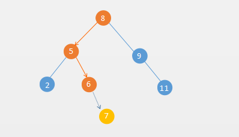

# Set集合的基本概念

Set集合是对数学中集合的抽象，Set集合有两个特性：

- Set集合里`没有重复`元素
- Set集合是`无序`集合


# Set集合的基本操作

1. 插入
2. 删除
3. Set是否为空
4. Set是否包含某个元素
5. Set元素个数

可以将以上几个操作定义一下几个方法

```java
public interface Set<T> {
    void add(T e);
    boolean contains(T e);
    void remove(T e);
    boolean isEmpty();
    int size();
}
```

# 实现 Set 集合

Set集合底层我们可以使用顺序的线性表、链表、二叉树来实现。下面分别使用二分搜索树和链表来实现下Set集合


## 二分搜索树实现Set

二分搜索树实现Set，可以使用到了前面介绍的二分搜索树的实现类 `BST.java`

关于二分搜索树，有需要的可以查看 [《8. 二分搜索树BST》](mks/collections/BST.md)

```java
public class BSTSet<T extends Comparable<T>> implements Set<T> {

    private BST<T> bst;

    public BSTSet() {
        bst = new BST<>();
    }

    @Override
    public void add(T e) {
        bst.add(e);
    }

    @Override
    public boolean contains(T e) {
        return bst.contains(e);
    }

    @Override
    public void remove(T e) {
        bst.contains(e);
    }

    @Override
    public boolean isEmpty() {
        return bst.isEmpty();
    }

    @Override
    public int size() {
        return bst.size();
    }
}
```

## 链表实现Set

链表实现Set，使用以前介绍的链表实现类 `LinkedList.java`

关于链表的内容，有需要的可以查看[《2. 链式存储及 LinkedList 源码解析》](mks/collections/LinkedList.md)

```java
public class LinkedListSet<T> implements Set<T> {

    private LinkedList<T> linkedList;

    public LinkedListSet() {
        linkedList = new LinkedList<>();
    }

    @Override
    public void add(T e) {
        if (!linkedList.contains(e)) {
            linkedList.addFirst(e);
        }
    }

    @Override
    public boolean contains(T e) {
        return linkedList.contains(e);
    }

    @Override
    public void remove(T e) {
        linkedList.remove(e);
    }

    @Override
    public boolean isEmpty() {
        return linkedList.isEmpty();
    }

    @Override
    public int size() {
        return linkedList.size();
    }
}

```

利用`Set`的特性：不允许元素重复。我们可以使用Set集合来统计下两本英文原著`双城记(A Tale of Two Cities)`和`傲慢与偏见(Pride and Prejudice)`的词汇量


```text
Pride and Prejudice
	Total words: 125901
	Total different words: 6530

A Tale of Two Cities
	Total words: 141489
	Total different words: 9944

```

从上面的数据可以看出，傲慢与偏见词汇量`6530`，双城记为`9944`，。这个统计只是简单的统计，比如单词的时态，单复数等都当做一个新单词。


## 两种实现方式的时间复杂度分析


我们来对比下基于二分搜索树和链表来实现的Set和的性能差异：

```text
pride-and-prejudice.txt
	Total words: 125901
	Total different words: 6530

pride-and-prejudice.txt
	Total words: 125901
	Total different words: 6530

BSTSet        Time: 0.121546597
LinkedListSet Time: 2.122136759

```

根据上面的统计数据可以看出，`BSTSet` 比 `LinkedListSet`快`20倍`左右。

我们知道链表的插入操作的时间复杂度是`O(1)`，但是实现Set集合需要先判断集合中是否存在(contains)，所以总的下来插入的操作为`O(n)`

那么二分搜索树的插入时间复杂度呢？ 假如我们往以下一个二分搜索树插入元素 `7`，插入路径如下图所示：



根据插入路径我们知道，插入元素`7`，只要和`8`、`5`、`6`作比较，不需要和链表一样最坏的情况需要和每个元素进行比较。而这个路径也就是二分搜索树的高度。下面用一个表格来对比二分搜索树实现的Set和链表实现的Set的时间复杂度：


操作     | LinkedListSet | BSTSet
---------|---------------|-------
add      |   O(n)        | O(h)
contains |   O(n)        | O(h)
remove   |   O(n)        | O(h)


`h`就是二分搜索树的高度，那么高度 `h` 和二分搜索树节点数 `n` 的关系是什么呢？

分析下满的二叉树的情况就知道了节点数量和二叉树高度的的关系了。


层数 | 该层的节点数
-----|-------
0层  |   1
1层  |   2
2层  |   4
3层  |   8
4层  |   16
h-1层|   2^(h-1)

那么一个h层的满二叉树总共有多少节点呢？就是每层的元素个数相加：

`n = 2^0+2^1+2^3+2^4+...+2^(h-1) = 2^h - 1`

用对数表示就是：`h = log(n+1)`

用大O表示法就是： `O(h) = O(log n)`


操作     | LinkedListSet | BSTSet
---------|---------------|-------
add      |   O(n)        | O(log n)
contains |   O(n)        | O(log n)
remove   |   O(n)        | O(log n)


对比下 `log(n)` 和 `n` 的差距

 n      |  log(n)   |  差距
--------|------     |-------
16      |   4       |  4 倍
1024    |   10      |  100倍
100w    |   20      |  5w倍


这也就是为什么上面的的BSTSet和LinkedListSet快那么多的原因。

我们上面对于二分搜索树的分析是基于满二叉树的，也就是最好的情况下，但是我们知道二分搜索树在最坏的情况会退化成链表，这就需要用到平衡二叉树如 `AVL树`、`红黑树`，就算是最坏的情况也能保证二分搜索树的不会退化成链表，保持树大致的平衡，后面会介绍到平衡二叉树相关的内容。

# Reference
本文主要内容和大纲是学习了慕课网 liuyubobobo 老师的视频[《算法大神带你玩转数据结构 从入门到精通》](https://coding.imooc.com/class/207.html)
有需要的同学可以看看, 真心不错. 墙裂推荐... 最好能加上自己的思考和理解.


