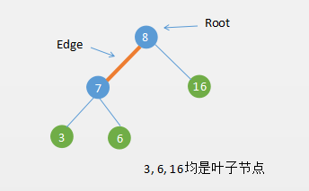
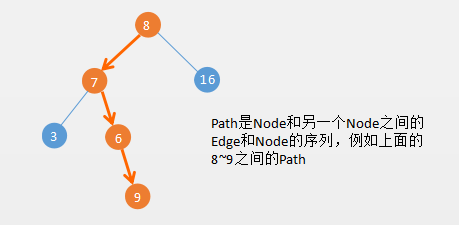
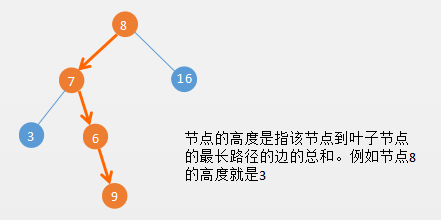
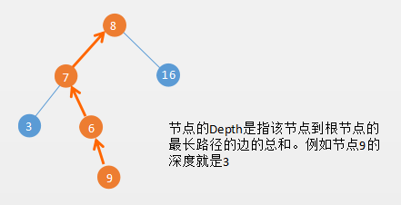
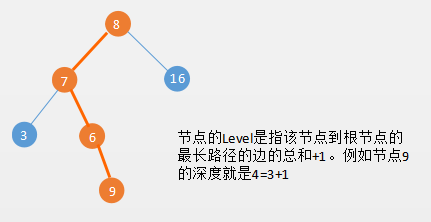
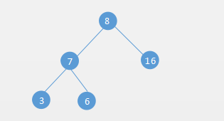
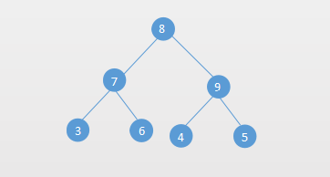
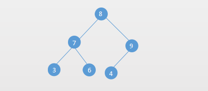
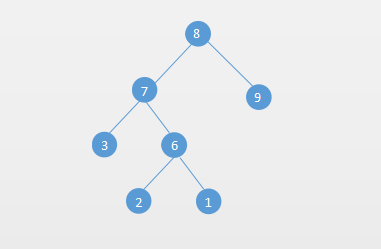

# 树的基本概念

下面的关于Tree的术语主要来自 [维基百科](https://en.wikipedia.org/wiki/Tree_(data_structure))

术语  |   中文      |  描述                          
---   |------       |------------------------------- 
Root  |   根节点    | The top node in a tree.                   
Child |  子节点     | A node directly connected to another node when moving away from the Root.
Leaf  |  叶子节点   | A node with no children
Edge  |   边        | The connection between one node and another.
Path  |   路径      | A sequence of nodes and edges connecting a node with a descendant.
Height|   节点高度  | The height of a node is the number of edges on the longest path between that node and a leaf.
Level |   层级      | The level of a node is defined by 1 + (the number of connections between the node and the root).
Depth |   深度      | The depth of a node is the number of edges from the tree's root node to the node.
Degree|   度        | The number of subtrees of a node.


下面通过几个图解释树的几个比较重要的概念：

## Edge、Root、Leaf




## Path



## Height



需要注意的是叶子节点的高度为0，如果树只有一个节点，那么这个节点的高也是0

## Depth



需要注意的是根节点的深度（Depth）是 `0`.

从`Height`和`Depth`的对比，它们的方向刚好是相反的。

对于`Height`和`Depth`不用死记，我们可以把树倒过来看，也就是我们现实生活当中的树，求某个节点的Height那肯定是从根部往上的方向；

如果是求某个节点的深度，方向肯定是向下的。

## Level



节点的Level是从1开始的，Level = Depth+1，根节点的Level=1

也有很多书籍上Level是从0开始的，这样的话Level就等于Depth，根节点的Level=0

# 二叉树

## 二叉树的基本概念

就如我们以前介绍的`线性表`一样，一个没有限制的线性表应用范围可能有限，但是我们对线性表进行一些限制就可以衍生出非常有用的数据结构如栈、队列、优先队列等。

树也是一样，一个没有限制的树 由于太灵活，控制起来比较复杂。如果对普通的树加上一些人为的限制，比如节点只允许有两个子节点，这就是我们接下来要介绍的`二叉树`。

二叉树是一个每个最结最多只能有`两个分支`的树，左边的分支称之为`左子树`，右边的分支称之为`右子树`。

也就是说二叉树节点的度最大也就是2，而普通的树，节点的度是没有限制的。 




##  二叉树的分类

### 1. 完美/满二叉树(Perfect Binary Tree)

完美二叉树也有很多教材上称之为满二叉树。完美二叉树满足两个特性：

1. 所有的几点都包含两个子节点
2. 所有的叶子节点的`Height`或者`Level`都相等

例如下面就是一个完美二叉树：



### 2. 完全二叉树(Complete Binary Tree)

完全二叉树是 除了最后一层都是满的（都有两个子节点），并且最后一层的节点是从左往右排列的。

完全二叉树，通俗点说就是节点按层从左往右排列。如果最后一层排满了就是完美二叉树，没有满则是完全二叉树。

所以完美二叉树一定是完全二叉树，完全二叉树不一定是完美二叉树。

一个完全二叉树可以高效的使用数组来表示。

例如下面就是一个完全二叉树：




### 3. 完满二叉树(Full Binary Tree)

完满二叉树就简单了，就是每个节点都有两个子节点。也就是说它比完美二叉树少了一个条件。

例如下面就是一个完满二叉树：




## 二叉树的存储

### 1. 顺序存储

下面用数组实现一个简单的二叉树：

```java
public class ArrayBinaryTree<T> {

    private static final int DEFAULT_DEEP = 5;
    private int deep;
    private int capacity;
    private Object[] nodes;

    public ArrayBinaryTree() {
        this(DEFAULT_DEEP);
    }

    public ArrayBinaryTree(int deep) {
        this.deep = deep;
        nodes = new Object[capacity = (int) Math.pow(2, deep) - 1];
    }

    public ArrayBinaryTree(int deep, T rootData) {
        this(deep);
        nodes[0] = rootData;
    }

    public void add(int parentIndex, T data, boolean left) {
        if (data == null) {
            throw new NullPointerException();
        }
        if (nodes[parentIndex] == null) {
            throw new NoSuchElementException();
        }

        if (left) {
            nodes[parentIndex * 2 + 1] = data;
        } else {
            nodes[parentIndex * 2 + 2] = data;
        }
    }

    public boolean isEmpty() {
        return nodes[0] == null;
    }

    /**
     * 获取索引为index节点的父节点
     *
     * @param index
     * @return
     */
    public T getParent(int index) {
        if (index == 0) {
            return null;
        }

        return (T) nodes[(index - 1) / 2];
    }

    /**
     * 获取索引为index的右节点
     *
     * @param index
     * @return
     */
    public T getRight(int index) {
        if (2 * index + 1 >= capacity) {
            return null;
        }
        return (T) nodes[index * 2 + 2];
    }

    /**
     * 获取索引为index的左节点
     *
     * @param index
     * @return
     */
    public T getLeft(int index) {
        if (2 * index + 1 >= capacity) {
            return null;
        }
        return (T) nodes[2 * index + 1];
    }

    public T getRoot() {
        return (T) nodes[0];
    }

    public int indexOf(T data) {
        for (int i = 0; i < capacity; i++) {
            if (nodes[i].equals(data)) {
                return i;
            }
        }
        return -1;
    }
}
```


### 2. 链式存储

下面实现一个二叉树的二叉链表存储，也就是一个Node存储了Left和Right。还有三叉链表存储，由于篇幅的原因，可以查看我的Github：


```java
public class TwoLinkedBinaryTree<T> {

    class Node {
        Object data;
        Node left;
        Node right;

        public Node() {
        }

        public Node(Object data) {
            this.data = data;
        }

        public Node(Object data, Node left, Node right) {
            this.data = data;
            this.left = left;
            this.right = right;
        }

        @Override
        public String toString() {
            return data + "";
        }
    }


    private Node root;

    public TwoLinkedBinaryTree() {
        this.root = new Node();
    }

    public TwoLinkedBinaryTree(T data) {
        this.root = new Node(data);
    }

    public Node addNode(Node parent, T data, boolean left) {
        if (data == null) {
            throw new NullPointerException();
        }

        if (parent == null) {
            throw new IllegalStateException("节点为null，不能添加子节点");
        }

        if (left && parent.left != null) {
            throw new IllegalStateException(parent + "节点已经存在左节点");
        }

        if (!left && parent.right != null) {
            throw new IllegalStateException(parent + "节点已经存在右节点");
        }

        Node node = new Node(data);
        if (left) {
            parent.left = node;
        } else {
            parent.right = node;
        }
        return node;
    }

    public boolean isEmpty() {
        return root.data == null;
    }

    public Node getRoot() {
        return root;
    }

    public T getLeft(Node parent) {
        return parent == null ? null : (T) parent.left.data;
    }

    public T getRight(Node parent) {
        return parent == null ? null : (T) parent.right.data;
    }
}
```


## 二叉树的遍历

树的遍历主要有两种，一个是深度优先遍历，一个是广度优先遍历。

深度优先遍历又有三种：前序、中序、后序遍历。

前序、中序、后序遍历区别在于访问节点的是前面访问还是中间访问或是后面访问，具体代码如下：

### 1. 前序遍历

```java
private void preorder(Node<T> node) {
	if (node == null) {
		return;
	}
	System.out.println(node.value);//前面访问节点
	preorder(node.left);
	preorder(node.right);
}
```

### 2. 中序遍历

```java
private void inorder(Node<T> node) {
	if (node == null) {
		return;
	}
	inorder(node.left);
	System.out.println(node.value);//中间访问节点
	inorder(node.right);
}

```

### 3. 后序遍历

```java
private void postorder(Node<T> node) {
	if (node == null) {
		return;
	}
	postorder(node.left);
	postorder(node.right);
	System.out.println(node.value);//最后访问节点
}

```

### 4. 广度优先遍历

广度优先遍历也叫做按层遍历（一层一层的遍历节点）：

```java
public void levelorder() {
	if (root == null)
		return;
	Deque<Node<T>> queue = new ArrayDeque<>();
	queue.addLast(root);
	while (!queue.isEmpty()) {
		Node<T> node = queue.removeFirst();
		System.out.println(node.value);
		if (node.left != null) {
			queue.addLast(node.left);
		}
		if (node.right != null) {
			queue.addLast(node.right);
		}
	}
}
```

# 参考文档

- https://en.wikipedia.org/wiki/Tree_(data_structure)
- http://typeocaml.com/2014/11/26/height-depth-and-level-of-a-tree/


