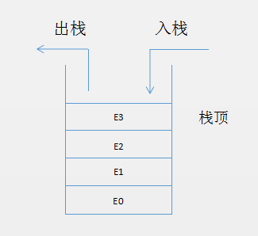

# 前言

前面两篇文章介绍了线性表的两种实现方式：`顺序`（数组）存储和`链式`存储。

本文介绍的栈是由线性表发展而来，可以把栈当做`被限制的线性表`，因为栈的定义是只能在固定的`一端`（栈顶）进行插入和删除操作。


# 栈的基本概念

是一个只能在某一端进行插入、删除操作的线性表。通常在线性表的尾端，或称栈顶。

由此我们知道栈是一个`后进先出`（LIFO，Last In First Out）的线性表

从栈顶插入一个元素称之为`入栈`（push）

从栈顶删除一个元素称之为`出栈`（pop）


# 栈的相关操作

因为栈是一个被限制了的线性表，通过索引来插入、删除、访问等操作在栈中是不支持的。

栈的常用操作：

1. 入栈：从栈顶插入一个元素
2. 出栈：从栈顶删除一个元素
3. 访问栈顶元素：访问栈顶的元素，但不删除
4. 栈是否为空：判断是否为空
5. 栈元素个数：返回栈里的元素个数
6. 清空栈：将整个栈清空

可以将以上几个操作定义一下几个方法:

```java
void push(T element)
T pop()
T peek()
boolean isEmpty()
int size()
void clear()
```

入栈、出栈操作示意图




# 顺序存储实现栈

因为栈也是一个线性表，我们已经在`《ArrayList、Vector源码剖析》`中实现了顺序存储的线性表，所以顺序存储来实现一个栈就很简单了。

```java
public class Stack<T> implements Iterable<T> {

    private static final int DEFAULT_SIZE = 10;
    //数组的长度
    private int capacity;
    //定义当底层数据容量不够时，每次增加的数组长度
    private int capacityIncrement;
    //用于保存顺序栈的元素
    private Object[] elementData;
    //元素的个数
    private int size;


    public Stack() {
        this.capacity = DEFAULT_SIZE;
        elementData = new Object[this.capacity];
    }

    public Stack(T element) {
        this();
        elementData[0] = element;
        size++;
    }


    public Stack(T element, int initSize) {
        this.capacity = initSize;
        elementData = new Object[this.capacity];
        elementData[0] = element;
        size++;
    }

    public Stack(T element, int initSize, int capacityIncrement) {
        this(element, initSize);
        this.capacityIncrement = capacityIncrement;
    }

    private void ensureCapacity(int minCapacity) {
        if (minCapacity > capacity) {
            if (capacityIncrement > 0) {
                while (capacity < minCapacity) {
                    capacity += capacityIncrement;
                }
            } else {
                //不断地capacity * 2,直到capacity大于minCapacity
                while (capacity < minCapacity) {
                    capacity <<= 1;
                }
            }
            elementData = Arrays.copyOf(elementData, capacity);
        }
    }


    public int size() {
        return size;
    }

    public void push(T element) {
        ensureCapacity(size + 1);
        elementData[size++] = element;
    }

    /**
     * 返回栈顶元素，并且删除该元素
     *
     * @return
     */
    public T pop() {
        T element = (T) elementData[size - 1];
        elementData[--size] = null;
        return element;
    }

    /**
     * 只返回栈顶元素，但不删除该元素
     *
     * @return
     */
    public T peek() {
        return (T) elementData[size - 1];
    }

    /**
     * 是否是空栈
     *
     * @return
     */
    public boolean isEmpty() {
        return size == 0;
    }

    /**
     * 清空栈内元素
     */
    public void clear() {
        Arrays.fill(elementData, null);
        size = 0;
    }

    @Override
    public Iterator<T> iterator() {
        return new MyIterator();
    }

    class MyIterator implements Iterator<T> {

        private int index = size - 1;

        public boolean hasNext() {
            return index >= 0;
        }

        public T next() {
            return (T) elementData[index--];
        }
    }
}
```

代码很简单，就不赘述了。

# 链式存储实现栈

```java
public class LinkedStack<T> implements Iterable<T> {

    //使用stackTop来记录当前栈顶的元素
    private Node stackTop;
    private int size;

    private class Node {
        T element;
        Node next;

        Node(T element, Node next) {
            this.element = element;
            this.next = next;
        }
    }


    public void push(T element) {
        stackTop = new Node(element, stackTop);
        size++;
    }

    public T pop() {
        Node oldTop = stackTop;
        stackTop = stackTop.next;
        //释放原栈顶元素next引用
        oldTop.next = null;
        size--;
        return oldTop.element;
    }


    public T peek() {
        return stackTop.element;
    }

    public int size() {
        return size;
    }

    public boolean isEmpty() {
        return size == 0;
    }

    public void clear() {
        stackTop = null;
        size = 0;
    }

    @Override
    public Iterator<T> iterator() {
        return new MyIterator();
    }

    private class MyIterator implements Iterator<T> {

        private Node current = stackTop;

        public boolean hasNext() {
            return current != null;
        }

        public T next() {
            T element = current.element;
            current = current.next;
            return element;
        }
    }
}
```

这里的stackTop就相当于以前介绍链表时候的tail。

# Java Stack 和 LinkedList

Java中的`Stack`底层是用数组实现的，也就是通过顺序存储的方式实现的 。继承自`Vector`类，所以它是线程安全的的。

我们前面介绍`LinkedList`的说到，`java.util.LinkedList`是一个不仅实现了`List`接口，还是实现了`Deque`接口，也就是说`LinkedList`不仅是链式存储的线性表还是一个`双端队列`。

当然也就可以当做栈来使用，`LinkedList`是链式实现的栈，`LinkedList`是非线程安全的。

在`Java`中，除了`Stack`和`LinkedList`外，`ArrayDeque`也可以作为栈使用，`ArrayDeque`和`LinkedList`一样，也是双端队列，一个是`基于数组`实现的，一个是`基于链表`实现的。


# 栈的实践

在计算机中栈的应用非常广泛，比如实现递归计算机需要用栈来存储（关于递归后面会单独用一篇文章来分析）。比如`Android`界面的管理也用栈来实现。下面使用栈来解决几个算法问题。


## LeetCode 第20号题有效的括号

描述如下：

给定一个只包括 `(`，`)`，`{`，`}`，`[`，`]` 的字符串，判断字符串是否有效。

有效字符串需满足：

1. 左括号必须用相同类型的右括号闭合。
2. 左括号必须以正确的顺序闭合。
3. 注意空字符串可被认为是有效字符串。

这个问题通过Stack很好解决，先把输入的字符串转化成字符数组， 遍历字符数组，如果当前字符是左括号 `(`、`{`、`[`  都`push`到栈中，如果当前字符是 `)` 则`pop`栈顶元素是否是 `)` ,如果当前字符是 `}` 则`pop`栈顶元素是否是 `{`, 如果当前字符是 `]` 则`pop`栈顶元素是否是 `[`，具体代码如下：

```java
public boolean isValid(String s) {
	Stack<Character> stack = new Stack<>();
	char[] cs = s.toCharArray();
	for (Character c : cs) {
		switch (c) {
			case '(':
			case '{':
			case '[':
				stack.push(c);
				break;
			case ')':
				if (stack.isEmpty() || stack.pop() != '(')
					return false;
				break;
			case '}':
				if (stack.isEmpty() || stack.pop() != '{')
					return false;
				break;
			case ']':
				if (stack.isEmpty() || stack.pop() != '[')
					return false;
				break;
		}
	}
	return stack.isEmpty();
}
```

## Dijkstra双栈算术表达式求值

在上面LeetCode的题目的基础上，我们进一步看下下面的 问题

求出表达式的值：`(1+((2+3)*(4*10)))`

我们可以使用两个栈来完成这个操作，一个栈用来存储数值的，一个栈用来存储操作符的，如果遇到 `)`，则从值栈中取出两个值，从操作符栈中取出一个操作符，然后对这两个值进行计算，把结果在放进值栈中。这是`Dijkstra`的双栈算术表达式求值法。

为了简单区间，我们把数字和操作符用空格分开，这样便于我们把字符串进行分割。代码如下：

```java
  private static double evaluate(String express) {
      Stack<String> ops = new Stack<>();
      Stack<Double> values = new Stack<>();
      String[] cs = express.split(" ");
      for (String s : cs) {
          switch (s) {
              case " ":
              case "(":
                  break;
              case "+":
              case "-":
              case "*":
              case "/":
                  ops.push(s);
                  break;
              case ")":
                  String op = ops.pop();
                  double v = values.pop();
                  switch (op) {
                      case "+":
                          v = values.pop() + v;
                          break;
                      case "-":
                          v = values.pop() - v;
                          break;
                      case "*":
                          v = values.pop() * v;
                          break;
                      case "/":
                          v = values.pop() / v;
                          break;
                  }
                  values.push(v);
                  break;
              default:
                  values.push(Double.parseDouble(s));

          }
      }
      return values.pop();

  }
//测试
public static void main(String[] args) {
	double value = evaluate("( 1 + ( ( 2 + 3 ) * ( 4 * 10 ) ) )");
	System.out.println(value);//201.0
}
```

